# LeadEngine

> 一个面向 B2B 出口的"获客 → 接待 → 成交"一体化平台：Meta CTW 广告投放 + WhatsApp AI 接待 + 知识库驱动的 leads 抽取。

技术栈：**Next.js 16（App Router）+ React 18 + Supabase（Postgres / RLS / Storage）+ Redis + Anthropic Claude（via OpenRouter）+ OpenAI（图像生成 / embeddings / Whisper）+ Tailwind CSS 4**。

文档地图：

- **本文（README.md）**：整体架构、前后端抽象、核心流程 UML、数据模型 UML
- **[USER_MANUAL.md](USER_MANUAL.md)**：面向平台租户的功能使用手册
- **[medici-design.md](medici-design.md)**：接待 Agent 设计
- **[ogilvy-design.md](ogilvy-design.md)**：投放 Agent 设计

---

## 1. 产品全景

LeadEngine 是单租户型 SaaS——每个 tenant 一个 founder（无团队），但同一 tenant 内可以跑**多条产品线**（product_lines）。"产品线"是平台的核心 scope 单位：

```
tenant ── product_line ─┬── 绑定一个 WhatsApp 号（用于接待）
                        ├── 绑定一个 Meta 广告账户（用于投放）
                        ├── 一套独立的知识库（kb_*）
                        ├── 一套独立的 lead_fields 字段表
                        └── 一套独立的"价值判定"规则
```

### 1.1 两个 AI Agent

| Agent | 命名缘起 | 用途 |
|---|---|---|
| **Medici** | 美第奇家族——同一对话里同时做银行业务与外交 | WhatsApp 入站接待 + 抽线索 + 评估 + 路由 |
| **Ogilvy** | 现代广告之父 David Ogilvy | Meta Click-to-WhatsApp 广告策划 + 素材生成 + 一键上线 |

两者互不调用，共享同一份基础设施（OpenRouter / Supabase / Redis / 计量），通过"Ogilvy 投广告 → 客户点击 → Medici 接待"形成业务闭环。

### 1.2 主要业务模块

- **LeadHub**——WhatsApp 询盘统一收件箱：会话 + 消息 + 抽出来的线索 + 备注
- **Product Lines**——产品线管理 + 内嵌知识库 + Medici 模拟器
- **Knowledge Base**（产品线详情页内嵌）——上传 → 解析 → 抽取 → embedding → 查询；含 QA snippets / 知识缺口 / 修正
- **Ogilvy**——Meta CTW 广告策划对话界面
- **Campaign Studio**——广告数据看板（只读，从 Meta Graph 拉）
- **Reports & Analytics**——AI 自动日报 / 周报 / 月报，询盘看板（含 LLM 摘要）
- **Settings**——Meta BM 连接、Feishu 通知 webhook
- **Admin**（仅 founder tenant）——租户管理、邀请、LLM 用量
- **Dev-tools**（内部）——只读 SQL 控制台 + AI 写 SQL 助手

---

## 2. 整体架构

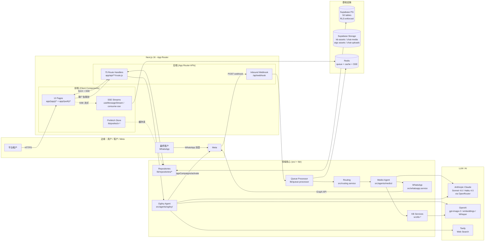

### 2.1 高阶分层

```
┌─────────────────────────────────────────────────────────────────┐
│                     UI Layer (React Client)                       │
│  app/(app)/*  app/(auth)/*  app/components/*                      │
│  - Prefetch store + use-prefetched hook                           │
│  - SSE 消费（KB sync / Ogilvy chat / 报表生成）                       │
└─────────────────────────────────────────────────────────────────┘
                              │ fetch + SSE
┌─────────────────────────────────────────────────────────────────┐
│                  API Layer (App Router Routes)                    │
│  app/api/**/route.js                                              │
│  - 唯一入口；调用 tenant-context / repositories / 领域服务            │
└─────────────────────────────────────────────────────────────────┘
                              │
┌─────────────────────────────────────────────────────────────────┐
│                  Domain Services (src/*.service.js)               │
│  src/agents/medici/   src/agents/ogilvy/   src/kb-*.service.js   │
│  src/routing.service  src/whatsapp.service  src/report-generator  │
│  - 业务逻辑、LLM 编排、与外部 API 对话                                │
└─────────────────────────────────────────────────────────────────┘
                              │
┌─────────────────────────────────────────────────────────────────┐
│                  Infra Plumbing (lib/*)                          │
│  lib/queue-processor  lib/lead-extractor  lib/tenant-context     │
│  lib/repositories/*   lib/redis  lib/sse  lib/core-trace         │
│  lib/meta-token-crypto  lib/meta-bm-resolver                     │
└─────────────────────────────────────────────────────────────────┘
                              │
┌─────────────────────────────────────────────────────────────────┐
│             Supabase (PG + RLS + Storage) + Redis                 │
└─────────────────────────────────────────────────────────────────┘
```

### 2.2 目录约定

| 目录 | 内容 |
|---|---|
| `app/(app)/*` | 已登录页面（侧边栏布局） |
| `app/(auth)/*` | 登录 / 注册 / 邀请页（无侧边栏） |
| `app/api/**/route.js` | App Router API 处理器；75 个端点 |
| `app/components/*` | 共享 UI 组件（Sidebar、DataTable、Card、Markdown、...） |
| `src/` | 领域服务：Medici / Ogilvy / KB / WhatsApp / 报告生成 / LLM 客户端 |
| `src/agents/medici/` | 接待 Agent |
| `src/agents/ogilvy/` | 投放 Agent |
| `src/agents/skills-runtime/` | Skill bundle 加载器（被 Medici/Ogilvy 共用） |
| `skills/` | Anthropic Skill 包（`ai-reception-deal` / `overseas-ad-planning`） |
| `lib/` | 基础设施：Supabase 客户端、repositories、Redis、SSE、租户上下文 |
| `lib/repositories/*.repository.js` | 数据访问层；每张主表一个文件 |
| `supabase/migrations/` | append-only DB migration（永不修改历史文件） |
| `.claude/index/` | 代码索引（MAP / glossary / 自动生成的 schema / routes） |
| `scripts/` | 部署 / 索引构建 / dev 启动器 |
| `ecosystem.config.cjs` | PM2 配置（queue-cron 长程进程 + Next.js 主进程） |

---

## 3. 前端抽象

### 3.1 路由组（Route Groups）

```
app/
├── (auth)/             ← 不带侧栏；只放登录、注册、邀请页
│   ├── login/page.js
│   ├── signup/page.js
│   └── invitation/[token]/page.js
└── (app)/              ← 已登录侧栏 layout
    ├── layout.js       ← Sidebar + main + GlobalLoadingOverlay
    ├── page.js         ← 入口分发：founder→/admin/tenants；普通→/analytics
    ├── leadhub/
    ├── product-lines/
    │   └── [id]/
    │       └── knowledge-base/
    ├── ogilvy/
    ├── campaign-studio/
    ├── reports/
    ├── analytics/
    ├── settings/
    ├── admin/          ← 仅 FOUNDER_TENANT_ID 可见
    └── dev-tools/
```

### 3.2 跨页面 UI 抽象

- **Prefetch Store** (`lib/prefetch-store.js`)
  Module-level Map cache，60s 新鲜 / 5min 陈旧；登录后 `PostLoginPreloader` 并发预热高频数据；`subscribeInflight` 给 GlobalLoadingOverlay 提供"正在加载"指示。

- **`usePrefetched(key)`** Hook (`lib/use-prefetched.js`)
  首屏 `readCache()` 命中即同步返回；后台 stale-while-revalidate。

- **SSE 消费**（`lib/consume-sse.js`）
  统一 SSE 解析器；按事件类型回调（`delta` / `tool_call` / `tool_result` / `done` / `error`）。

- **共享组件**（`app/components/`）
  Sidebar、DataTable、Card、Tag、MetricCard、TabBar、Markdown、Skeleton、EmptyState、PillBar、LeadDetail、AdPreviewModal、OnboardingProgressCard、ThemeProvider。

### 3.3 主要交互模式

- **Lead Hub**：左侧列表 + 右侧详情（chat / notes / inquiry-details / timeline 四 tab）；筛选维度 = 路由状态 × 询盘质量 × 日期
- **产品线详情**：标签页 = 基本 / 价值判定 / 字段表 / 知识库；知识库 sub-tab：文档 / QA snippets / 缺口 / 资产 / 修正 / 健康
- **Ogilvy**：左侧会话列表 + 中间 chat 流（流式 + 工具进度）+ 右侧 stage 归档时间线
- **AI 报告**：列表 + 详情；生成时 SSE 流式追加摘要

---

## 4. 后端抽象

### 4.1 一个请求的生命周期（API 路由典型）

```
HTTP Request
    │
    ▼
app/api/.../route.js  (Next.js Route Handler)
    │
    ├── getTenantContext()    ← 解析 cookie → { tenantId, userId, supabase }
    │                            （RLS 启用；service-role 仅在 lib/supabase-admin.js）
    │
    ├── 调用 lib/repositories/*.repository.js   ← 数据访问
    │
    ├── 调用 src/*.service.js                    ← 业务逻辑（KB、LLM、WhatsApp、...）
    │
    └── return Response.json(...)
```

### 4.2 共享基础设施

| 组件 | 文件 | 用途 |
|---|---|---|
| **租户上下文** | `lib/tenant-context.js` | 把当前请求的 tenantId / userId / RLS-aware supabase 客户端打包；99% 路由的第一句话 |
| **Webhook 租户解析** | `lib/meta-tenant-context.js` + `lib/meta-bm-resolver.js` | 入站 webhook 没 session，用 phone_number_id 反查 tenant |
| **Supabase 客户端** | `lib/supabase-{server,browser,admin}.js` | 三个职责严格分开；service-role 只在 admin |
| **Repositories** | `lib/repositories/*.repository.js` | 每张主表的 CRUD 封装；服务层只调它 |
| **Redis** | `lib/redis.js` | 单连接：queue 锁、SSE 流、限流 |
| **SSE** | `lib/sse.js` + `lib/consume-sse.js` | 服务端生成、客户端消费；可选 Redis Stream 跨进程透传 |
| **追踪** | `lib/core-trace.js` | 创建 trace_id；贯穿 webhook → queue → Medici → 出站全链路 |
| **配置入口** | `src/config.js` | 唯一读 `process.env.*` 的地方；其它模块全部从这里 import |
| **LLM 计量** | `src/llm-client.js` + `src/llm-pricing.js` | 所有 LLM 调用一次进出口；写 `llm_usage_logs` |

### 4.3 后台 worker / cron

| 任务 | 触发 | 用途 |
|---|---|---|
| `lib/queue-processor.js` | 进程内 setTimeout + cron 兜底 | 入站消息批量聚合（2–5s 窗口）后调 Medici |
| `kb-upload-bus`（Redis pub/sub） | KB 上传时 | 异步触发解析 / embedding pipeline |
| `cron/generate-reports` | 每日 | AI 自动报告生成 |
| `cron/meta-health-check` | 周期 | Meta token 续期 + 连接健康检查 |
| `cron/process-queue` | 周期 | 兜底跑 queue（防 setTimeout 漏） |
| `cron/recover-stale-kb-docs` | 周期 | 卡住的 KB 文档重跑解析 |
| `cron/release-takeovers` | 周期 | 人工接管到点自动释放 AI |

长程进程通过 PM2 跑（`ecosystem.config.cjs`），cron 是兜底。

---

## 5. 核心工作流程（UML）

### 5.1 WhatsApp 入站 → Medici 接待 → 出站

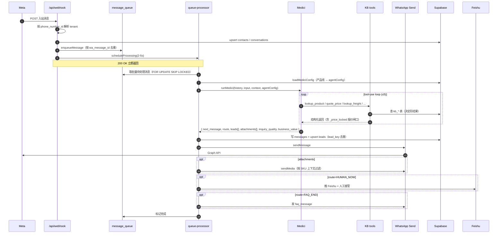

### 5.2 Ogilvy 广告策划 → 一键上线

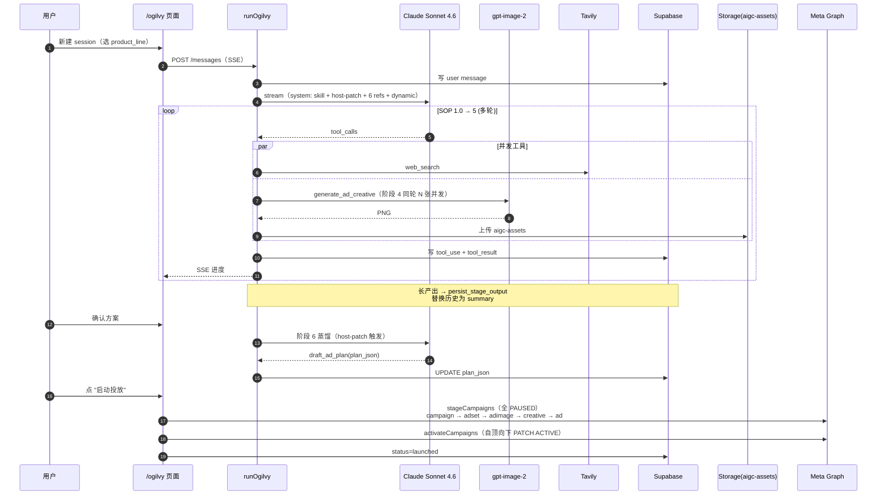

### 5.3 知识库上传 → 抽取 → 检索

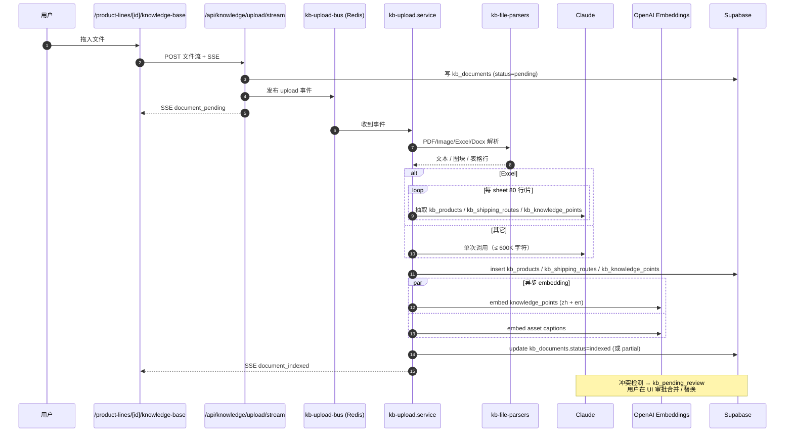

### 5.4 一次完整客户旅程（端到端）

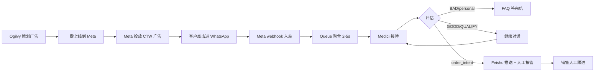

---

## 6. 数据模型（UML / ER 图）

平台共 50 张表（有些是历史遗留 orphan 表，详见 [`.claude/index/tables-actual-usage.md`](.claude/index/tables-actual-usage.md)）。下图只画**实际在跑的核心实体**。

### 6.1 租户 / 身份 / Onboarding

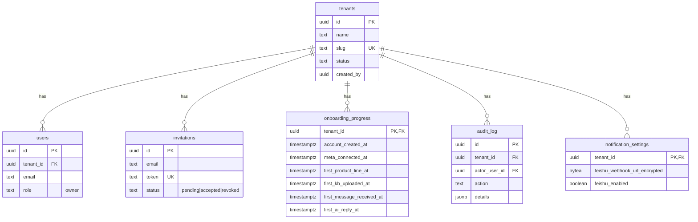

### 6.2 Meta / WhatsApp 连接

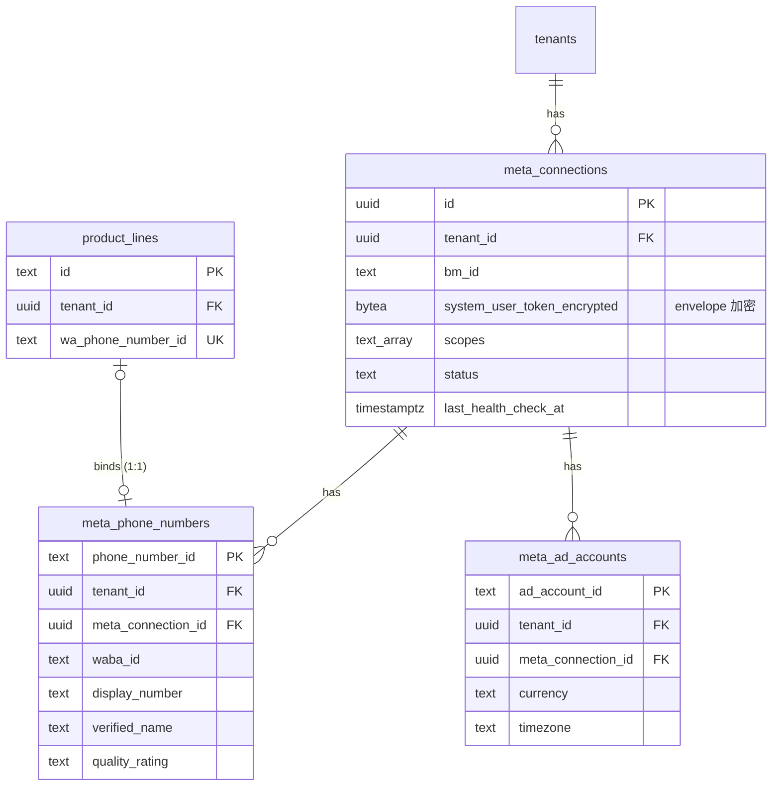

### 6.3 产品线 / 知识库（4 层结构）

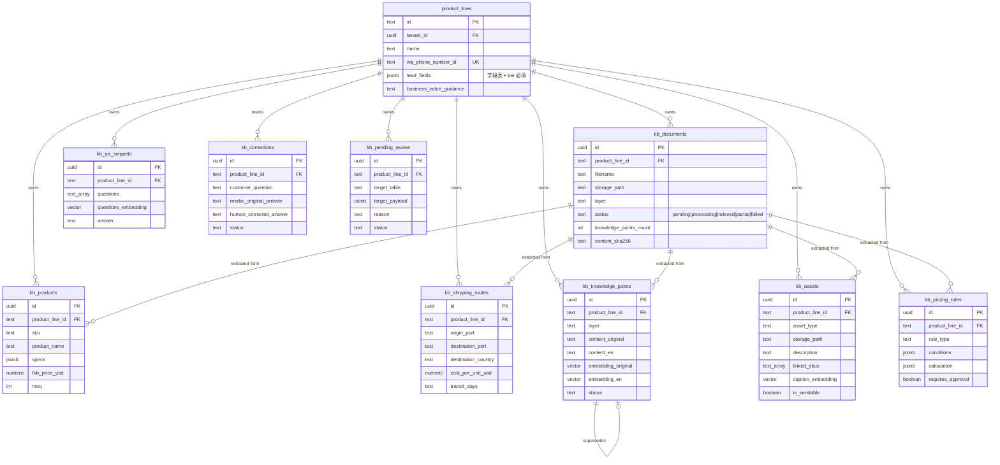

### 6.4 会话 / 消息 / 线索

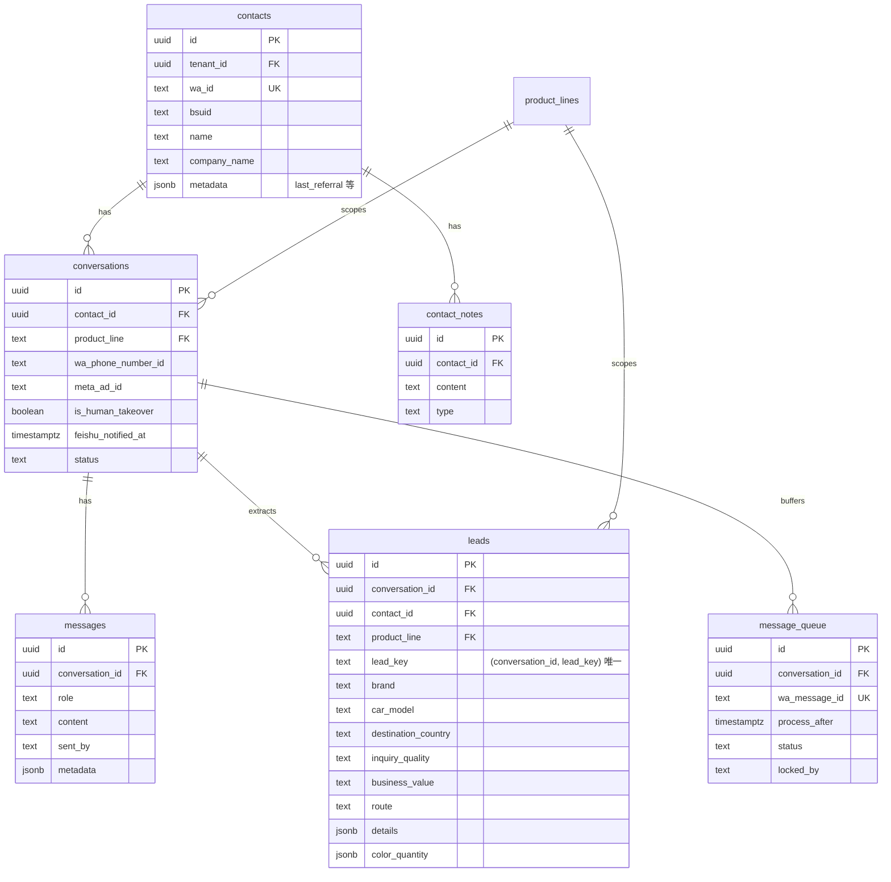

### 6.5 Ogilvy / 自动化

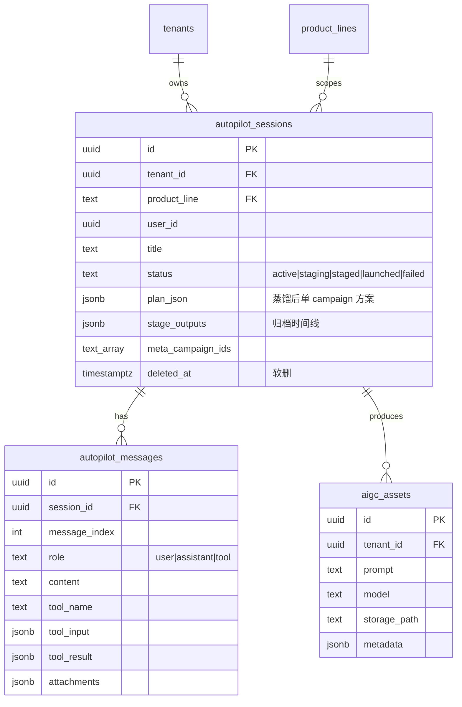

### 6.6 计量 / 报表

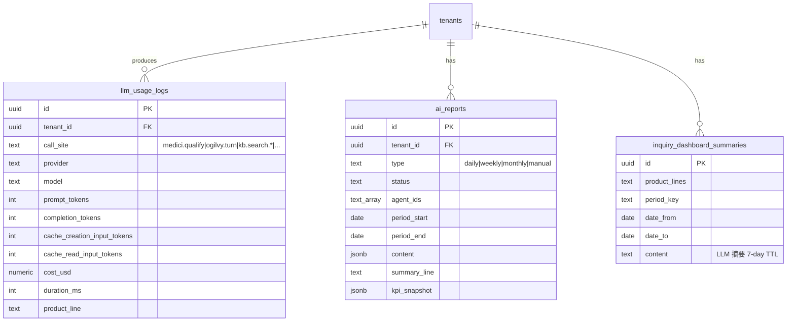

---

## 7. 关键设计决策

| 维度 | 选择 | 理由 |
|---|---|---|
| **单租户单 founder** | 是 | 服务对象就一个人，团队功能纯属过度设计 |
| **product_line 作为 scope** | 是 | KB / WA / Ads 都以它为单位；多业务线复用同一份代码 |
| **方法论 vs 宿主补丁** | Skill bundle + skill-host-patch.md | 方法论文件级热替换；宿主收口集中可审计 |
| **每轮强制 submit_response（Medici）** | 是 | 调用方永远拿到 schema 验证过的 JSON |
| **6 个 KB tool 决定形结果** | 是 | agent 走 if-else，不对相似度分数软判断 |
| **报价闸口 `_price_locked`** | 是 | leads 未齐 / SKU 未收敛 → 工具层抽掉价格字段；模型再聪明也吐不出 |
| **lead_key 唯一索引** | 是 | 同会话同主产品永远只一行；复盘重抽 UPSERT |
| **Skill references 内联 vs 按需** | Medici 按需（read_skill_reference 工具），Ogilvy 内联 | Medici 长会话多轮、references 不一定都用到；Ogilvy 单会话短但每轮要用 |
| **2 个 cache breakpoint（Ogilvy）/ 3 个（Medici）** | 是 | Medici 多了"per-line context"（30+ assets）跨会话共享 |
| **Ogilvy 仅 CTW + 仅单 campaign** | 是 | 收窄到最确定的形态；其它形态在 host-patch 显式拒 |
| **生成图 URL 严格白名单** | 是 | 防 LLM 编 URL → Meta 误投真实第三方资源 |
| **两阶段 launch（PAUSED→ACTIVE）** | 是 | 创建中途失败也只堆 PAUSED；可手动到 Meta 后台启 |
| **软删除（Ogilvy sessions）** | 2026-05-11 事故后改 | FK 级联会删 messages，数据不可恢复 |
| **append-only migrations** | 是 | 永不编辑过去的 migration；保证回放 |
| **direct DB inspection** | 是 | dev-tools/sql 只读 + AI 写 SQL；不为读数据现编 API |
| **Meta token envelope 加密** | 是 | `META_TOKEN_ENCRYPTION_KEY` env；只在最里层 service 解密 |
| **forward-compat schema** | 是 | 只增不删；老列保留至少一个版本周期 |

---

## 8. 本地开发

### 8.1 起步

```bash
cp .env.local.example .env.local         # 填 Supabase / OpenRouter / OpenAI / Meta / Redis 等
npm install
npm run dev                              # node scripts/dev-with-redis.mjs 起本地 Redis + Next dev server
```

默认端口 3000；prod 是 3002（`npm start`）。

### 8.2 常用命令

```bash
npm run dev          # 本地开发
npm run build        # 构建
npm start            # 生产模式（3002）
npm run lint
npm run deploy       # sh ./scripts/deploy.sh（生产部署）
npm run queue:start  # PM2 起 queue-cron
npm run index        # 重建 .claude/index/{schema,routes}
```

### 8.3 数据库

Supabase（cloud）。schema 变更通过 `supabase/migrations/<YYYY-MM-DD-name>.sql` 推。

只读 SQL：`/dev-tools/sql`（founder-only），底层是 `dev_exec_sql` Postgres RPC。

### 8.4 部署

`scripts/deploy.sh` 走 `npm run build` + PM2 reload。Production 上 `npm run release` 触发 GitHub Actions 自动部署（见 `1a78dd7` 提交）。

---

## 9. 进一步阅读

- [USER_MANUAL.md](USER_MANUAL.md) — 平台租户使用手册
- [medici-design.md](medici-design.md) — Medici 详细设计
- [ogilvy-design.md](ogilvy-design.md) — Ogilvy 详细设计
- `.claude/index/MAP.md` — 功能 → 文件导航地图
- `.claude/index/glossary.md` — 领域名词表
- `.claude/index/schema.md` — 自动生成的当前 DB schema 快照
- `.claude/index/routes.md` — 自动生成的所有 API + 页面路由清单
- `CLAUDE.md` — 给 Claude Code 工程协作约束

---

## 10. 许可

Private. © LeadEngine.
