# LeadEngine · Prome Engine

WhatsApp 智能获客 + AI 广告投放一体化平台。基于 Next.js 全栈架构，集成 WhatsApp Cloud API 自动接待询盘、Claude AI 多轮对话线索孵化，以及 ChatGPT 风格的 Click-to-WhatsApp 广告自动化投放（Autopilot）。

## Tech Stack

| 层级 | 技术 |
|------|------|
| Framework | Next.js 16 (App Router, RSC) |
| Frontend | React 18, CSS Modules, next-intl (i18n) |
| Backend | Next.js API Routes + Node.js ES Modules |
| Database | Supabase (PostgreSQL + Storage + RLS) |
| Cache / Stream | Redis (ioredis) — SSE event stream、广告数据缓存 |
| LLM | OpenRouter → Anthropic Claude (Sonnet 4.6 / Haiku 4.5)；OpenAI (Whisper + embeddings) |
| AIGC | OpenRouter 图像链：Gemini 3.1 Flash Image → 2.5 Flash Image → GPT-5 Image（降级链） |
| External | WhatsApp Cloud API、Meta Marketing Graph API v21、Firecrawl、SerpAPI、Feishu Bot |
| Process | PM2 (4 进程: app + 3 cron) |
| Deploy | tar + scp + PM2 restart (`scripts/deploy.sh`) |
| Test | Vitest (unit), Playwright (e2e 已配置) |

---

## Architecture Overview

### Use Case Diagram — 系统全貌

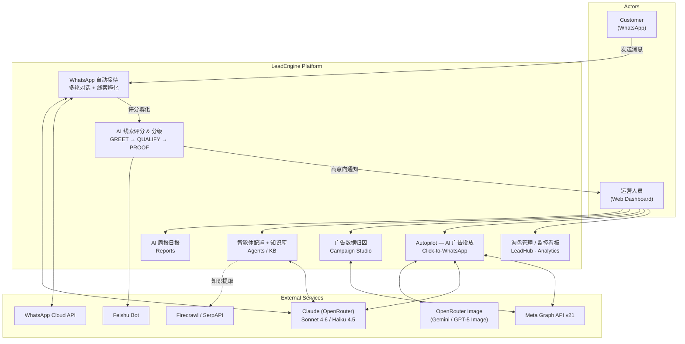

### Layered Architecture

```
┌──────────────────────────────────────────────────────────────┐
│  Browser  (React 18 + CSS Modules + SSE Client + next-intl) │
├──────────────────────────────────────────────────────────────┤
│  Next.js App Router                                          │
│  ┌────────────────┐ ┌──────────────┐ ┌────────────────────┐  │
│  │ Pages  app/()/ │ │ API Routes   │ │ Middleware         │  │
│  │ RSC + CSR      │ │ app/api/*    │ │ Auth + i18n        │  │
│  └────────────────┘ └──────┬───────┘ └────────────────────┘  │
├────────────────────────────┼─────────────────────────────────┤
│  Service Layer  (src/)     │                                 │
│  ┌───────────┐ ┌───────────┴─────┐ ┌──────────────────────┐ │
│  │ WhatsApp  │ │  Autopilot      │ │ Agent Router /       │ │
│  │ Service   │ │  (src/autopilot)│ │ Runtime (tool-use)   │ │
│  └───────────┘ │  single-loop    │ └──────────────────────┘ │
│                └─────────────────┘                           │
│  ┌────────────┐ ┌──────────────┐ ┌─────────────────────┐    │
│  │ LLM Client │ │ Knowledge    │ │ Meta Ads / MCP      │    │
│  │ (OpenRouter)│ │ Base (kb-*)  │ │ Whisper / Feishu    │    │
│  └────────────┘ └──────────────┘ └─────────────────────┘    │
├──────────────────────────────────────────────────────────────┤
│  Utility Layer  (lib/)                                       │
│  ┌────────┐ ┌───────┐ ┌────────────┐ ┌───────────────────┐  │
│  │ SSE    │ │ Redis │ │ Queue      │ │ Repositories      │  │
│  │ stream │ │       │ │ Processor  │ │ (Supabase CRUD)   │  │
│  └────────┘ └───────┘ └────────────┘ └───────────────────┘  │
├──────────────────────────────────────────────────────────────┤
│  Infrastructure                                              │
│  ┌───────────────┐  ┌────────┐  ┌──────────────────────┐    │
│  │ Supabase      │  │ Redis  │  │ PM2  (4 processes)   │    │
│  │ PG + Storage  │  │        │  │                      │    │
│  └───────────────┘  └────────┘  └──────────────────────┘    │
└──────────────────────────────────────────────────────────────┘
```

**分层约定：**
- `app/api/*` — 只做参数校验 + 调用 `src/` 服务 + 拼响应，不写复杂业务
- `src/` — 重业务（调 LLM / Meta API / WhatsApp），不得 import React / Next
- `lib/` — 前后端共用的工具和数据仓储，可被 `src/` 和 `app/` 同时引用
- `lib/repositories/` — 所有 Supabase CRUD 封装，统一数据访问入口
- **env 只能从 `src/config.js` 读** — 业务代码禁止直接访问 `process.env.XXX`（唯一例外：`lib/supabase-browser.js` 的 `NEXT_PUBLIC_*` 行内读取）

---

## Directory Structure

```
LeadEngine/
├── app/                         # Next.js App Router
│   ├── (app)/                   #   认证后页面 (Sidebar layout)
│   │   ├── analytics/           #     监控看板
│   │   ├── reports/             #     AI 周报日报
│   │   ├── ai-automation/       #     Autopilot (AI 广告投放)
│   │   ├── campaign-studio/     #     广告数据 + 归因分析
│   │   ├── leadhub/             #     询盘私信
│   │   ├── agents/              #     智能体配置
│   │   │   └── [id]/knowledge-base/  # 知识库 (嵌入 agent 详情页)
│   │   └── dev-tools/           #     开发者工具
│   ├── (auth)/                  #   登录页
│   ├── api/                     #   API Route Handlers
│   │   ├── webhook/             #     WhatsApp Webhook 入口
│   │   ├── autopilot/           #     Autopilot 会话 / 启动 / 上传
│   │   ├── ads/                 #     Meta Ads 数据 / dashboard / creative-image
│   │   ├── inquiries/           #     询盘列表 + 质量筛选
│   │   ├── inquiry-dashboard/   #     询盘看板聚合
│   │   ├── contacts/            #     联系人 CRUD
│   │   ├── conversations/       #     对话详情
│   │   ├── leads/               #     线索 CRUD / 审批 / 同步
│   │   ├── knowledge/           #     知识库 CRUD / 搜索 / 教学
│   │   ├── agents/              #     Agent CRUD
│   │   ├── reports/             #     AI 报告读取 / 导出
│   │   ├── ai/report/           #     触发单次报告生成
│   │   ├── media/               #     WhatsApp 媒体反代
│   │   ├── send-message/        #     手动发送 WA 消息
│   │   ├── product-assets/      #     产品资产上传
│   │   ├── health/              #     健康检查
│   │   ├── dev-tools/           #     内部诊断端点
│   │   └── cron/                #     PM2 cron 内部端点
│   │       ├── sync-leads/
│   │       ├── process-queue/
│   │       ├── generate-reports/
│   │       └── release-takeovers/
│   └── components/              #   共享 UI 组件
│       ├── Sidebar/             #     Prome Engine 导航
│       ├── Markdown/            #     Markdown 渲染器
│       ├── DataTable/ Card/ Button/ Tag/ PillBar/ TabBar/ MetricCard/
│       └── AIPanel/             #     AI 侧栏
│
├── src/                         # Backend 业务逻辑层
│   ├── config.js                #   统一环境变量配置（唯一真源）
│   ├── llm-client.js            #   OpenRouter / OpenAI 封装（fetch-based，零 SDK）
│   ├── whatsapp.service.js      #   WhatsApp Cloud API 封装
│   ├── whatsapp-media.service.js#   WA 媒体下载 / 反代
│   ├── whisper.service.js       #   OpenAI Whisper 语音转文字
│   ├── agent-router.service.js  #   多 Agent 路由（按产品线分流）
│   ├── agent-runtime.service.js #   Agent 执行引擎（tool-use loop）
│   ├── routing.service.js       #   线索路由 + scoring
│   ├── inquiry-quality.js       #   询盘质量评估规则
│   ├── feishu.service.js        #   飞书卡片通知
│   ├── kb-*.service.js          #   知识库系列：search / upload / auto-learn / tools / feishu-import / file-parsers
│   ├── product-knowledge.service.js / product-search.service.js
│   ├── meta-account.service.js  #   Meta 账户资产（WABA/Page/Pixel）
│   ├── meta-ads-mcp-client.js   #   Meta Ads MCP Client（可选）
│   └── autopilot/               #   Autopilot 独立子系统 (5 files)
│       ├── agent.service.js     #     单 Agent 循环 (tool-use + streaming)
│       ├── tools.service.js     #     web_search / read_webpage 工具实现
│       ├── creative.service.js  #     广告图生成（三模型降级链）
│       ├── meta-launch.service.js #   Meta Graph 三层上架 (stage → activate)
│       └── whatsapp-accounts.service.js # 可用 WA 号码发现 + 60s 缓存
│
├── lib/                         # 工具层 & 数据访问层
│   ├── supabase-server.js       #   Server-side Supabase client
│   ├── supabase-browser.js      #   Browser-side Supabase client
│   ├── redis.js                 #   Redis singleton (shared + blocking clients)
│   ├── sse.js                   #   SSE 推送 (generator → ReadableStream)
│   ├── consume-sse.js           #   SSE 消费 (断线重连 + lastEventId)
│   ├── queue-processor.js       #   消息聚合队列
│   ├── conversation-context.service.js # 路由后对话上下文
│   ├── referral-context.js      #   广告归因解析
│   ├── lead-extractor.js        #   线索字段提取
│   ├── demo-mode.js             #   Demo 模式拦截
│   ├── core-trace.js            #   请求链路 traceId 日志
│   ├── repositories/            #   Repository 层 (Supabase CRUD)
│   │   ├── contact.repository.js / conversation.repository.js
│   │   ├── message.repository.js / queue.repository.js
│   │   ├── lead.repository.js / agent.repository.js
│   │   ├── knowledge-base.repository.js
│   │   ├── autopilot.repository.js
│   │   └── sync-log.repository.js
│   ├── services/                #   跨模块业务胶水
│   │   ├── external-sync.js     #     线索 → REVO SCM
│   │   └── report-generator.js  #     AI 报告生成器
│   ├── api/                     #   前端 fetch 封装 (agents / knowledge / http)
│   └── constants/product-lines.js
│
├── supabase/migrations/         # 数据库 Schema 迁移 (~40 SQL 文件)
├── scripts/                     # 运维脚本 & Cron 入口
│   ├── deploy.sh                #   一键部署 (tar → scp → npm ci → PM2 restart)
│   ├── cron-sync-leads.js       #   线索同步 (30s)
│   ├── cron-process-queue.js    #   队列兜底 (10s)
│   ├── cron-generate-reports.js #   AI 报告 (每日 08:00 CST)
│   ├── seed-*-agent.js          #   Agent 种子数据
│   └── test-*.js                #   本地诊断 / 调试脚本
├── docs/autopilot-design.md     # Autopilot 详细设计文档
└── ecosystem.config.cjs         # PM2 进程配置
```

---

## Core Flows

### Flow 1 — WhatsApp 消息处理

客户从 WhatsApp 发消息到线索入库的全链路：

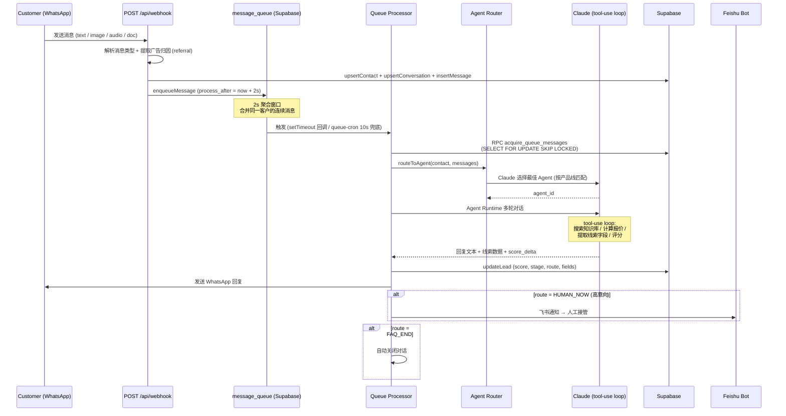

**关键设计点：**

| 设计 | 说明 |
|------|------|
| **消息聚合** | 客户连续发多条消息时等 2s 合并为一次 LLM 调用，降本提效 |
| **分布式锁** | `SELECT FOR UPDATE SKIP LOCKED` 保证多实例不重复处理 |
| **Agent 路由** | Claude 根据对话上下文 + 产品信号自动选择 Agent（汽配/农机/整车等） |
| **线索评分** | 每轮对话更新 score/stage/route，达阈值触发飞书通知人工 |
| **Cron 兜底** | `queue-cron` 每 10s 检查，防止 `setTimeout` 回调在进程重启时丢失 |
| **人工接管自释放** | `isHumanTakeover` 拦截 AI 自动回复；闲置 1h 后由 `release-takeovers` 端点恢复 |

### Flow 2 — Autopilot（Click-to-WhatsApp 广告编排）

ChatGPT 风格的单 Agent 循环：用户聊产品、上传参考图，AI 一口气产方案 + 生成素材 + 一键上架 Meta。

> 详细设计见 [docs/autopilot-design.md](docs/autopilot-design.md)。

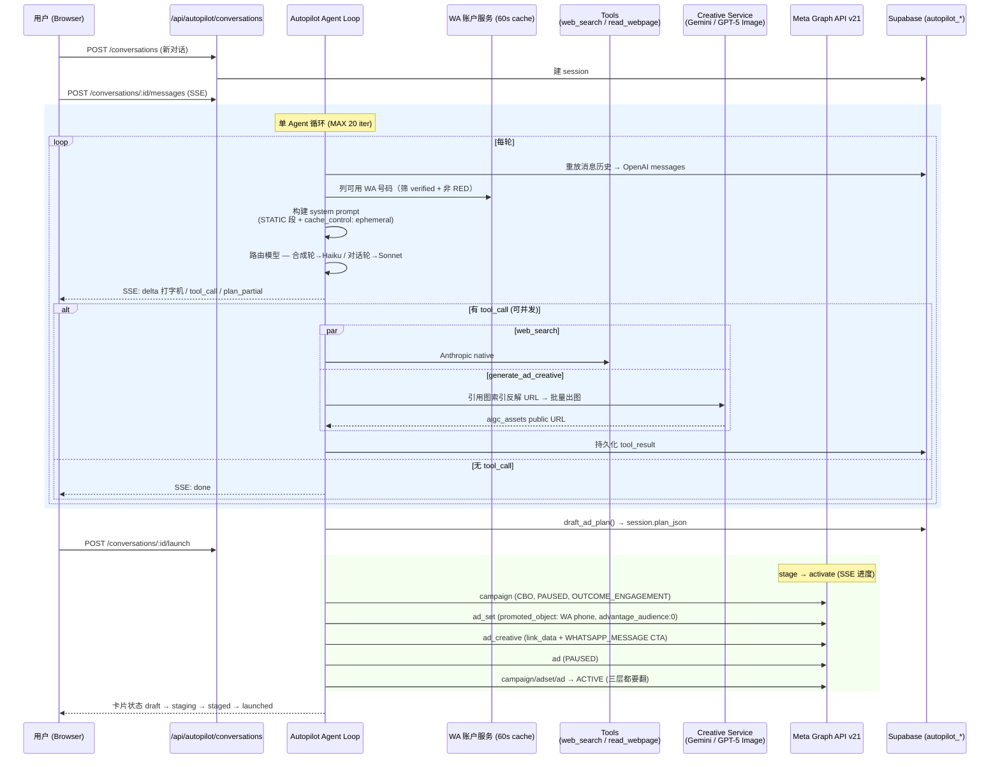

**关键设计点：**

| 设计 | 说明 |
|------|------|
| **1 对话 = 1 campaign** | schema / dispatcher / prompt 三层把 `campaigns.length` 锁死为 1；多市场多受众靠同 campaign 下的多 ad_sets 表达 |
| **固定广告目标** | `objective=OUTCOME_ENGAGEMENT` + `optimization_goal=CONVERSATIONS` + `destination_type=WHATSAPP` |
| **双模型路由** | 对话轮用 Sonnet 4.6，合成轮 (末消息 role=tool) 用 Haiku 4.5，省成本提速 3–5× |
| **Prompt 拆静/动** | STATIC 段挂 `cache_control: ephemeral`，provider 固定 `anthropic`（避免 Bedrock 剥除 flag），命中省 70%+ input tokens |
| **同轮 tool_calls 并行** | `Promise.all` + 事件队列，3 张素材 60s → 20s |
| **渐进式预览** | `plan_partial` 事件每积累 ~200 字 `tryPartialJson()` 一次，前端 AdPlanCard 实时"看到字段在填" |
| **素材降级链** | Gemini 3.1 Flash Image → 2.5 Flash Image → GPT-5 Image；任一成功即返 |
| **引用图索引化** | 用户上传图通过 `reference_image_ids: [1,2]` 引用，dispatcher 反解为 Supabase URL，杜绝 URL 幻觉 |
| **流看门狗** | `STREAM_IDLE_TIMEOUT_MS=30s / STREAM_TOTAL_TIMEOUT_MS=180s`，任一超触发 AbortController |
| **三层 ACTIVE** | Meta 只有 campaign + ad_set + ad 三层全部翻 ACTIVE 才真正出广告，漏一层就显示"广告组已关闭" |
| **冷冻老编排器** | 旧 5 阶段 Orchestrator (campaign_briefs / orchestrator_*) 已冷冻存档，老表不 drop、不再写入 |

### Flow 3 — SSE 实时推送

项目里有两种 SSE 模型：

#### (a) Autopilot — 直连 SSE（无 Redis）

`lib/sse.js::streamSSE(generator)` 把 async generator 包成 `ReadableStream` 直接返回给浏览器。前端 `AbortController.abort()` 即可中断流；`ReadableStream.cancel()` 回调触发 `generator.return?.()` 后端清理干净。**不支持断线续传**——刷新中断后已持久化的消息不丢，in-flight delta 丢失可接受。

#### (b) 长任务 — Redis Stream（支持 lastEventId 续传）

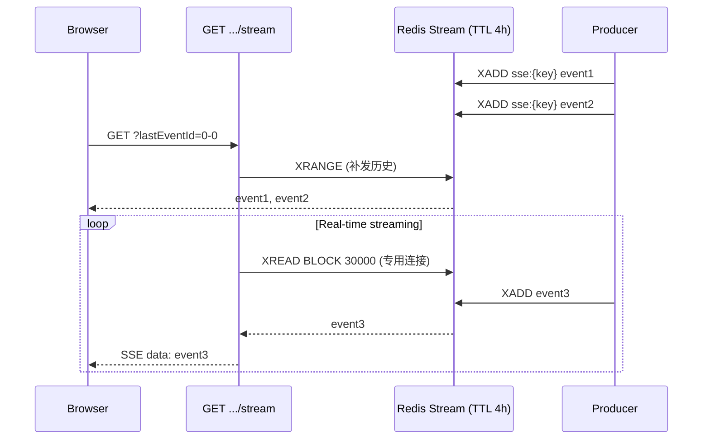

`XREAD BLOCK` 走独立 `createBlockingClient()`，避免阻塞主连接池。

---

## Data Model

### Core Tables (ER Diagram)

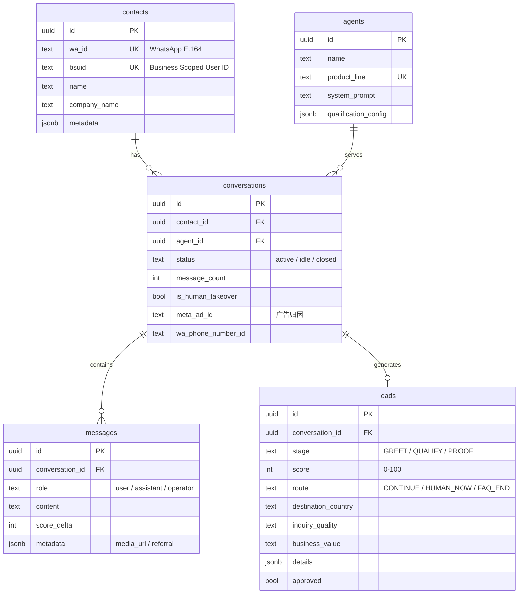

### Autopilot Tables (2026-04 new)

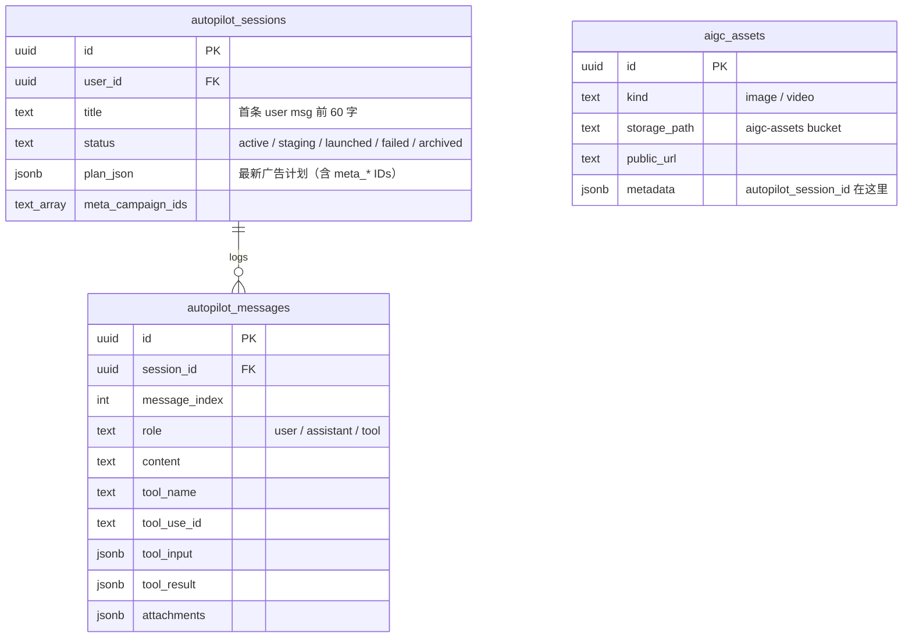

> 旧的 `campaign_briefs` / `orchestrator_sessions` / `orchestrator_messages` / `fix_knowledge` 表**冷冻存档**——老代码已清理干净，新系统不写入，表也不 drop，保留历史会话可查。

### Knowledge Base Tables

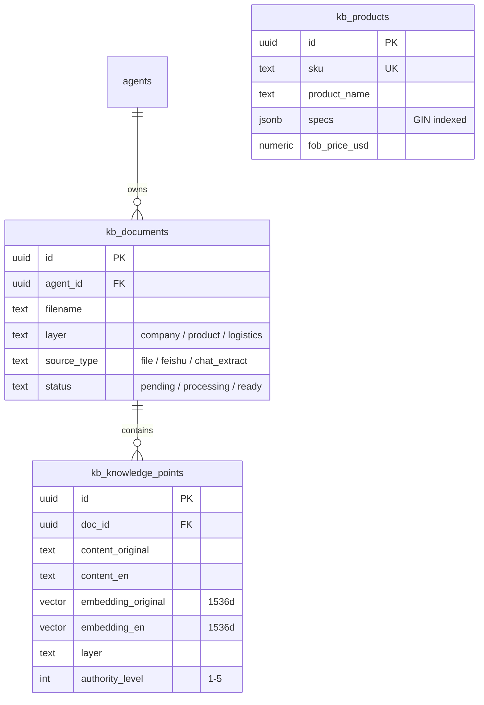

### Key Design Patterns

| 模式 | 说明 |
|------|------|
| **双标识符联系人** | `wa_id` + `bsuid` 至少一个非空，查询时 bsuid 优先 |
| **消息聚合队列** | `message_queue` + `SELECT FOR UPDATE SKIP LOCKED` 分布式锁 |
| **对话 Agent 作用域** | 同联系人 × 同 Agent 最多 1 个活跃对话（部分唯一索引）|
| **pgvector 双语嵌入** | `kb_knowledge_points` 中英文双向量，分层 RPC 检索 |
| **Autopilot 单表计划** | 最新方案全部塞 `autopilot_sessions.plan_json`，历史由消息流回放 |
| **AIGC 资产解耦** | 图像落 `aigc_assets` + `aigc-assets` bucket；autopilot session id 放 `metadata` 字段，FK 对 WA `conversations` 写 null |

---

## PM2 Process Model

生产环境由 PM2 管理 **4 个常驻进程**，配置见 `ecosystem.config.cjs`：

```
┌──────────────────────────────────────────────────────────────┐
│  PM2 Daemon                                                  │
│                                                              │
│  ┌────────────────────────┐  Port 3002, fork, max 1GB        │
│  │  1. lead-engine-next   │  Next.js 主进程                  │
│  └────────────────────────┘                                  │
│  ┌────────────────────────┐  setInterval 30s, max 256MB      │
│  │  2. lead-sync-cron     │  线索 → REVO SCM 同步            │
│  └────────────────────────┘                                  │
│  ┌────────────────────────┐  setInterval 10s, max 256MB      │
│  │  3. queue-cron         │  消息队列兜底                    │
│  └────────────────────────┘                                  │
│  ┌────────────────────────┐  每分钟检查, 08:00 CST 触发      │
│  │  4. report-cron        │  AI 报告生成                     │
│  └────────────────────────┘                                  │
│                                                              │
│  日志: logs/{app,lead-sync,queue-cron,report-cron}-{out,error}.log │
└──────────────────────────────────────────────────────────────┘
```

> **精简历史**：早期有第 5 个 `orchestrator-recovery` 进程负责恢复旧 Campaign Orchestrator 的卡住会话；Autopilot 上线后旧编排器整体冷冻，该进程一起下线。Autopilot 的中断处理走 `AbortController`，不需要独立恢复进程。

### Process 1: `lead-engine-next` — Next.js 主进程

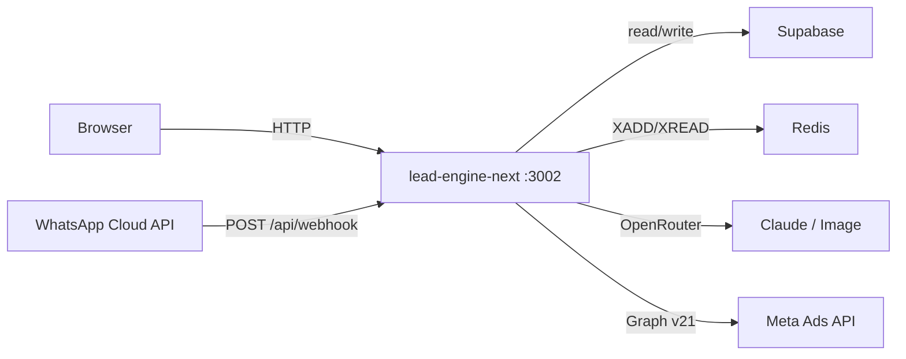

**职责：**
- 前端页面 SSR + 静态资源服务
- 所有 API Routes，包括 WhatsApp Webhook、Autopilot SSE、Campaign Studio 数据查询、知识库 CRUD、AI 报告等
- Autopilot Agent 循环的实际执行体（在请求生命周期内流式推送，SSE `cancel()` 回调清理 generator）
- 对外唯一暴露端口（3002），3 个 cron 进程均通过 HTTP 调用此进程的 `/api/cron/*` 端点

### Process 2: `lead-sync-cron` — 线索同步到外部 SCM

**脚本：** `scripts/cron-sync-leads.js` → `POST /api/cron/sync-leads`

每 30 秒将运营人员审核通过（approved）的线索同步到外部 SCM 系统（REVO）。

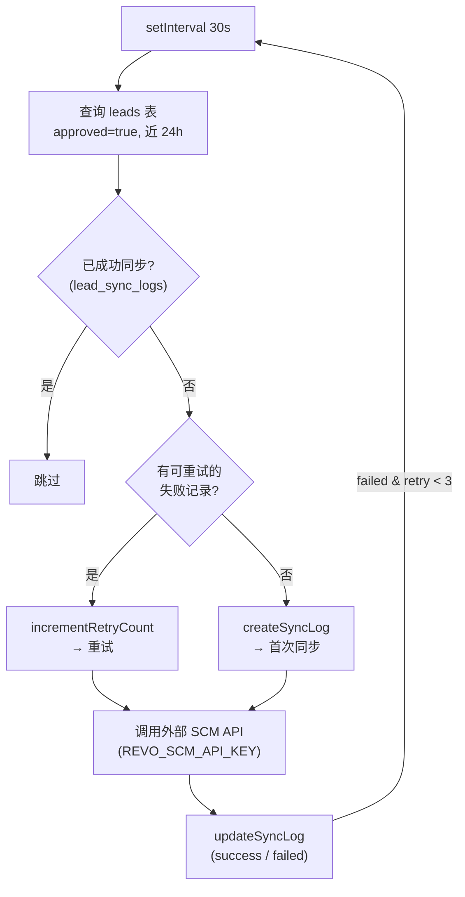

**内部逻辑：**
1. 查询 `leads` 表中 `approved=true` 且近 24h 的记录
2. 对比 `lead_sync_logs` 表，过滤已成功同步的，识别可重试的失败记录
3. 调用外部 REVO SCM API 批量推送
4. 将同步结果（success/failed/external_id）写回 `lead_sync_logs`
5. 失败记录保留，下一轮自动重试（最多 3 次）

### Process 3: `queue-cron` — 消息队列兜底处理

**脚本：** `scripts/cron-process-queue.js` → `GET /api/cron/process-queue`

每 10 秒扫描 `message_queue` 表，处理因 `setTimeout` 回调丢失或进程崩溃而未消费的消息。这是消息处理链路的**兜底保障**——正常情况下消息由 Webhook 直接触发处理。

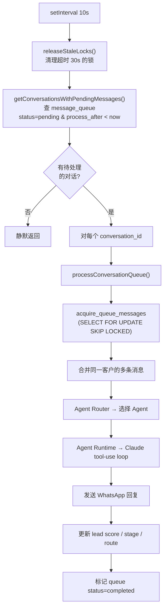

### Process 4: `report-cron` — AI 报告自动生成

**脚本：** `scripts/cron-generate-reports.js` → `POST /api/cron/generate-reports`

每分钟检查时间，在每天 **08:00 CST（北京时间）** 触发一次报告生成。根据日期自动决定生成哪些类型的报告。

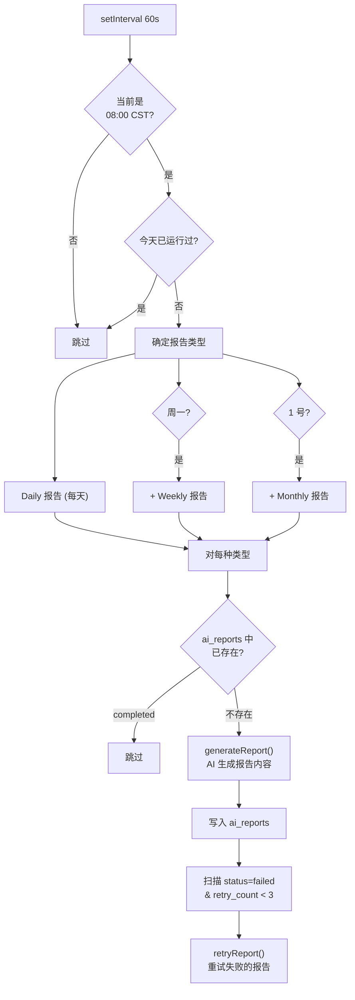

**内部逻辑：**
1. 每分钟检查是否到达 08:00 CST，防止重复执行（`lastRunDate` 去重）
2. 根据星期和日期确定生成类型：Daily（每天）、Weekly（周一）、Monthly（1 号）
3. 对每种类型调用 `generateReport()`，AI 分析询盘/线索/广告数据生成报告
4. 去重：`ai_reports` 表 UNIQUE `(type, period_start, period_end)` 防止重复
5. 自动重试：扫描 `status=failed` 且 `retry_count < 3` 的历史失败报告

### 辅助端点：`/api/cron/release-takeovers`

释放闲置 1h+ 的人工接管状态（`conversations.is_human_takeover=false`），走常规 cron secret 鉴权。未挂 PM2，可由外部定时器（系统 cron / 云定时）按需调用；可用 `TAKEOVER_AUTO_EXPIRE=off` 临时禁用。

### 进程间通信关系

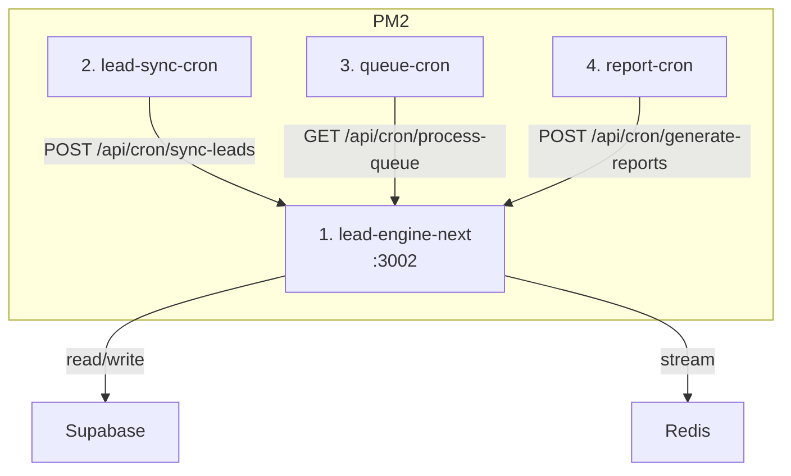

> **设计说明：** 3 个 cron 进程本身不包含业务逻辑，仅作为定时触发器通过 HTTP 调用主进程的 `/api/cron/*` 端点。这样做的好处是：业务逻辑集中在一个进程中维护，cron 进程无需加载 Next.js 也无需直连数据库，且可通过浏览器手动调用同一端点进行测试。

---

## Quick Start

### Prerequisites

- Node.js >= 18（推荐 20 LTS，与部署脚本一致）
- Redis（local or remote）
- Supabase project（migrations applied）

### 本地开发

```bash
# 安装依赖
npm install --legacy-peer-deps

# 配置环境变量
cp .env.demo .env.local
# 编辑 .env.local 填入实际密钥 (参考下方环境变量表)

# 数据库迁移
# 在 Supabase Dashboard 或 CLI 中执行 supabase/migrations/ 下的 SQL
# 最新：2026-04-16-autopilot.sql

# 启动开发服务器
npm run dev          # http://localhost:3002

# (可选) 启动后台进程
npm run cron:start   # lead-sync (PM2)
npm run queue:start  # queue-processor (PM2)
```

### 部署

```bash
npm run deploy       # 打包 → scp → 远程 npm ci → next build → PM2 全量重启
```

`scripts/deploy.sh` 里硬编码了目标机 `SERVER=aws-online`，首次部署请按注释准备机器（Node 20 + PM2 + redis-server）。

### 测试

```bash
npm test                  # Vitest 单元测试
npm run test:webhook-tdd  # Webhook TDD 子集 (原生 node --test)
```

E2E 使用 `@playwright/test`（已装未默认脚本化），按需 `npx playwright test` 运行。

---

## Environment Variables

完整配置见 [src/config.js](src/config.js)，关键变量：

| 变量 | 用途 | 必填 |
|------|------|------|
| `NEXT_PUBLIC_SUPABASE_URL` | Supabase 项目 URL | Yes |
| `NEXT_PUBLIC_SUPABASE_PUBLISHABLE_DEFAULT_KEY` | Supabase Anon Key | Yes |
| `OPENROUTER_API_KEY` | OpenRouter API Key (LLM + 图像生成全部走这里) | Yes |
| `OPENAI_API_KEY` | OpenAI Direct (仅 Whisper + embeddings) | Yes |
| `WA_TOKEN` | WhatsApp Cloud API Token | Yes |
| `WA_PHONE_NUMBER_ID` | WhatsApp 发送号码 ID | Yes |
| `WA_VERIFY_TOKEN` | Webhook 验证令牌 | Yes |
| `REDIS_URL` | Redis 连接地址（默认 `redis://127.0.0.1:6379`） | Yes |
| `META_SYSTEM_TOKEN` | Meta Graph API Token（需 `whatsapp_business_management` + `ads_management` + `business_management`）| Autopilot |
| `META_AD_ACCOUNT_ID` | Meta 广告账户 ID | Autopilot |
| `META_PAGE_ID` | Meta Page ID（作为广告投放主体） | Autopilot |
| `HTTPS_PROXY` / `HTTP_PROXY` | 访问 Meta API 的出口代理（中国大陆部署用） | Optional |
| `FIRECRAWL_API_KEY` | Firecrawl 网页抓取 | KB/AI |
| `SERPAPI_KEY` | SerpAPI Google Trends | Optional |
| `FEISHU_APP_ID` / `FEISHU_APP_SECRET` / `FEISHU_CHAT_ID` | 飞书通知 & KB 导入 | Optional |
| `AIGC_IMAGE_MODEL` | 主图像模型，默认 `google/gemini-3.1-flash-image-preview` | Optional |
| `AIGC_BEST_OF_N` / `AIGC_NO_FALLBACK` | 图像质量/降级策略 | Optional |
| `CRON_SECRET` | 内部 `/api/cron/*` 端点鉴权 | Yes (prod) |
| `REVO_SCM_API_KEY` | 外部 SCM 同步令牌 | Lead sync |
| `QUEUE_AGGREGATION_MS` / `QUEUE_MAX_RETRIES` / `QUEUE_LOCK_TIMEOUT_MS` | 队列聚合/锁调优 | Optional |
| `TAKEOVER_AUTO_EXPIRE` | `off` 关闭人工接管自动释放 | Optional |
| `DEMO_MODE` | `true` 跳过登录 + 禁写操作 | Optional |
| `NEXT_PUBLIC_APP_URL` | 自指 base URL（Webhook 内部回调用） | Prod |

---

## Development Conventions

- **改数据库 Schema** — 新建 `supabase/migrations/YYYY-MM-DD-xxx.sql`，不直接在控制台改
- **新增字段前先查表关系** — 能用 JOIN 就不加冗余列（见 [CLAUDE.md](CLAUDE.md)）
- **环境变量单一真源** — 业务代码只从 `src/config.js` 读，禁止直接 `process.env.XXX`（唯一例外：`lib/supabase-browser.js`）
- **`src/` 不 import React/Next** — 必须对 runtime 中立，能被脚本和 API 同时调用
- **测试必须真跑** — 不能只做静态 review（见 [CLAUDE.md](CLAUDE.md)）
- **谨慎加"改进"** — 不添加 fallback 值、默认行为或用户未要求的字段（见 [CLAUDE.md](CLAUDE.md)）
- 更多约定见 [CLAUDE.md](CLAUDE.md) 和 [docs/autopilot-design.md](docs/autopilot-design.md)
