# LeadEngine

WhatsApp 智能获客 + AI 广告投放一体化平台。基于 Next.js 全栈架构，集成 WhatsApp Cloud API 自动接待询盘、Claude AI 多轮对话线索孵化、以及端到端的 Meta Ads 广告投放自动化。

## Tech Stack

| 层级 | 技术 |
|------|------|
| Framework | Next.js 16 (App Router, RSC) |
| Frontend | React 18, CSS Modules, next-intl (i18n) |
| Backend | Next.js API Routes + Node.js ES Modules |
| Database | Supabase (PostgreSQL + pgvector + RLS + Realtime) |
| Cache / Stream | Redis (ioredis) — SSE event stream, distributed lock |
| LLM | Anthropic Claude (direct / OpenRouter), Gemini, MiniMax |
| External | WhatsApp Cloud API, Meta Marketing API (MCP), Firecrawl, SerpAPI, OpenAI Whisper |
| Process | PM2 (5 进程: app + 4 cron) |
| Deploy | tar + scp + PM2 restart (`scripts/deploy.sh`) |
| Test | Vitest (unit), Playwright (e2e) |

---

## Architecture Overview

### Use Case Diagram — 系统全貌

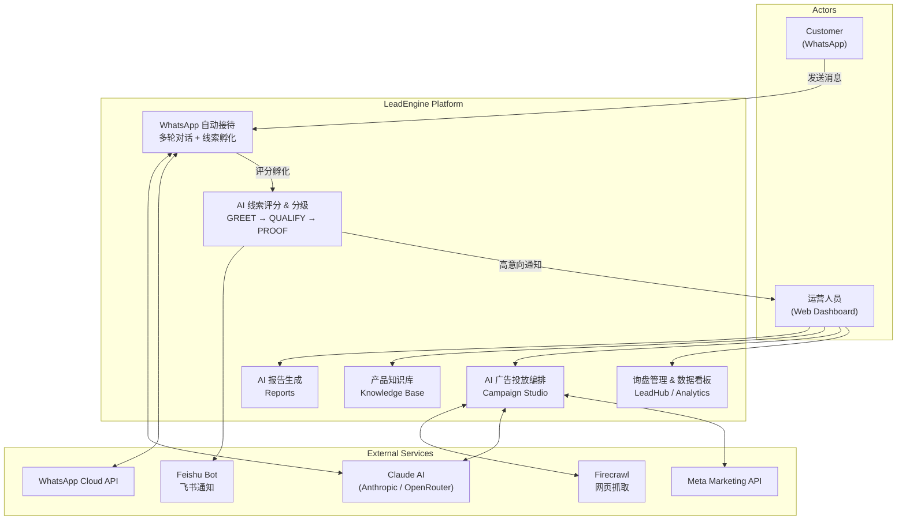

### Layered Architecture

```
┌──────────────────────────────────────────────────────────────┐
│  Browser  (React 18 + CSS Modules + SSE Client + next-intl) │
├──────────────────────────────────────────────────────────────┤
│  Next.js App Router                                          │
│  ┌────────────────┐ ┌──────────────┐ ┌────────────────────┐  │
│  │ Pages  app/()/ │ │ API Routes   │ │ Middleware         │  │
│  │ RSC + CSR      │ │ app/api/*    │ │ Auth + i18n        │  │
│  └────────────────┘ └──────┬───────┘ └────────────────────┘  │
├────────────────────────────┼─────────────────────────────────┤
│  Service Layer  (src/)     │                                 │
│  ┌───────────┐ ┌───────────┴─────┐ ┌──────────────────────┐ │
│  │ WhatsApp  │ │  Campaign       │ │ Agent Router /       │ │
│  │ Service   │ │  Orchestrator   │ │ Runtime (tool-use)   │ │
│  └───────────┘ │  (5-phase AI)   │ └──────────────────────┘ │
│                └─────────────────┘                           │
├──────────────────────────────────────────────────────────────┤
│  Utility Layer  (lib/)                                       │
│  ┌────────┐ ┌───────┐ ┌────────────┐ ┌───────────────────┐  │
│  │ SSE    │ │ Redis │ │ Queue      │ │ Repositories      │  │
│  │ stream │ │       │ │ Processor  │ │ (Supabase CRUD)   │  │
│  └────────┘ └───────┘ └────────────┘ └───────────────────┘  │
├──────────────────────────────────────────────────────────────┤
│  Infrastructure                                              │
│  ┌───────────────┐  ┌────────┐  ┌──────────────────────┐    │
│  │ Supabase      │  │ Redis  │  │ PM2  (5 processes)   │    │
│  │ PG + pgvector │  │        │  │                      │    │
│  └───────────────┘  └────────┘  └──────────────────────┘    │
└──────────────────────────────────────────────────────────────┘
```

**分层约定：**
- `app/api/*` — 只做参数校验 + 调用 `src/` 服务 + 拼响应，不写复杂业务
- `src/` — 重业务（调 LLM / Meta API / WhatsApp），不得 import React / Next
- `lib/` — 前后端共用的工具和数据仓储，可被 `src/` 和 `app/` 同时引用
- `lib/repositories/` — 所有 Supabase CRUD 封装，统一数据访问入口

---

## Directory Structure

```
LeadEngine/
├── app/                         # Next.js App Router
│   ├── (app)/                   #   认证后页面 (Sidebar layout)
│   │   ├── analytics/           #     数据看板
│   │   ├── campaign-studio/     #     AI 投放工作台
│   │   ├── leadhub/             #     询盘管理
│   │   ├── agents/              #     Agent 配置
│   │   ├── knowledge-base/      #     产品知识库
│   │   └── reports/             #     AI 报告
│   ├── api/                     #   API Route Handlers (~60 routes)
│   │   ├── webhook/             #     WhatsApp Webhook 入口
│   │   ├── campaign/            #     Campaign Orchestrator (SSE)
│   │   ├── ads/                 #     Meta Ads 数据查询
│   │   ├── contacts/            #     联系人 CRUD
│   │   ├── leads/               #     线索 CRUD / 同步
│   │   ├── knowledge/           #     知识库 CRUD / 搜索
│   │   └── cron/                #     PM2 Cron 内部端点
│   └── components/              #   共享 UI 组件
│       ├── PhaseCards/          #     Campaign 阶段可视化卡片
│       ├── Sidebar/             #     导航侧边栏
│       ├── Markdown/            #     Markdown 渲染器
│       └── DataTable/           #     可排序/筛选表格
│
├── src/                         # Backend 业务逻辑层
│   ├── config.js                #   统一环境变量配置
│   ├── llm-client.js            #   LLM 抽象层 (Claude/Gemini/MiniMax)
│   ├── whatsapp.service.js      #   WhatsApp Cloud API 封装
│   ├── agent-router.service.js  #   多 Agent 路由 (按产品线分流)
│   ├── agent-runtime.service.js #   Agent 执行引擎 (tool-use loop)
│   ├── campaign-orchestrator.service.js  #  5 阶段投放编排
│   ├── campaign-intake.service.js        #  需求收集 Agent
│   ├── research-agent-v2.service.js      #  市场调研 Agent
│   ├── strategy-agent.service.js         #  策略规划 Agent
│   ├── creative-plan.service.js          #  创意规划 Agent
│   ├── aigc.service.js                   #  AI 图片生成 (OpenRouter)
│   ├── execution-agent.service.js        #  Meta 广告创建 Agent
│   ├── meta-ads-mcp-client.js            #  Meta Ads MCP Client
│   └── kb-*.service.js                   #  知识库系列服务
│
├── lib/                         # 工具层 & 数据访问层
│   ├── supabase-server.js       #   Server-side Supabase client
│   ├── redis.js                 #   Redis singleton (stream/lock/signal)
│   ├── sse.js                   #   SSE 推送 (generator → ReadableStream → Redis)
│   ├── consume-sse.js           #   SSE 消费 (browser reconnect)
│   ├── queue-processor.js       #   消息聚合队列
│   └── repositories/            #   Repository 层 (Supabase CRUD)
│
├── supabase/migrations/         # 数据库 Schema 迁移 (20+ SQL)
├── scripts/                     # 运维脚本 & Cron 入口
│   ├── deploy.sh                #   一键部署
│   ├── cron-sync-leads.js       #   线索同步 (30s)
│   ├── cron-process-queue.js    #   队列兜底 (10s)
│   ├── cron-generate-reports.js #   AI 报告
│   └── cron-recover-orchestrator.js # 编排恢复
├── tests/                       # unit / integration / e2e
└── ecosystem.config.cjs         # PM2 进程配置
```

---

## Core Flows

### Flow 1 — WhatsApp 消息处理

客户从 WhatsApp 发消息到线索入库的全链路：

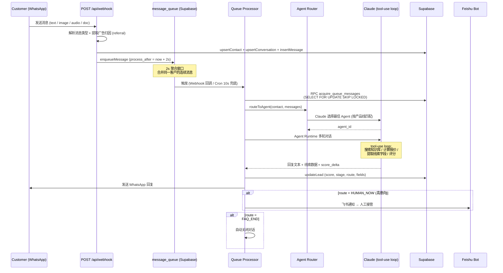

**关键设计点：**

| 设计 | 说明 |
|------|------|
| **消息聚合** | 客户连续发多条消息时等 2s 合并为一次 LLM 调用，降本提效 |
| **分布式锁** | `SELECT FOR UPDATE SKIP LOCKED` 保证多实例不重复处理 |
| **Agent 路由** | Claude 根据对话上下文 + 产品信号自动选择 Agent（汽配/农机等） |
| **线索评分** | 每轮对话更新 score/stage/route，达阈值触发飞书通知人工 |
| **Cron 兜底** | `queue-cron` 每 10s 检查，防止 Webhook 回调丢失 |

### Flow 2 — AI 广告投放编排 (Campaign Studio)

从用户输入需求到广告上线的 5 阶段自动化流程：

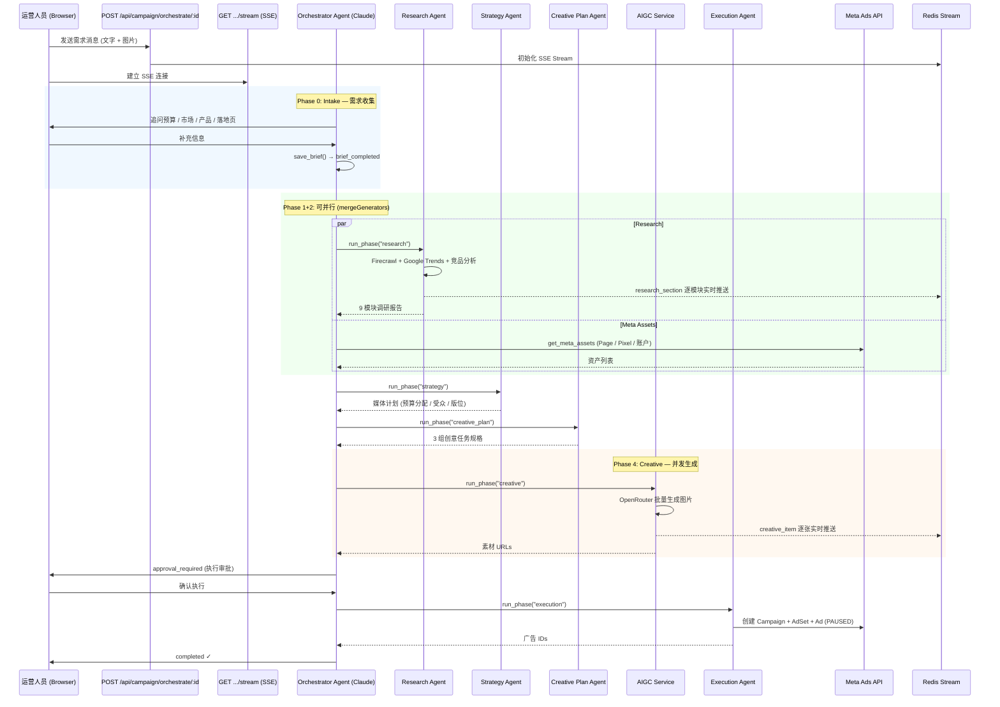

**Phase 依赖关系 & 编排规则：**

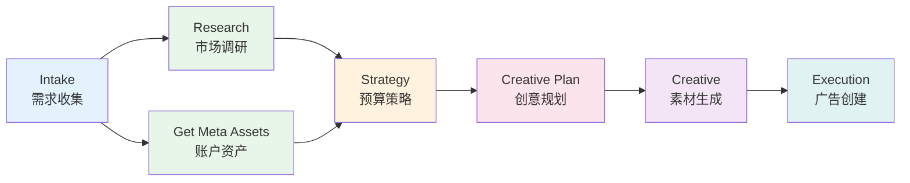

| 设计 | 说明 |
|------|------|
| **并行执行** | `mergeGenerators()` 合并多个 async generator，互不依赖的阶段并发 |
| **实时预览** | Research/Creative 阶段通过 SSE 逐模块/逐张推送，前端渐进渲染 |
| **级联失效** | 上游重跑时自动清除下游结果（strategy 重跑 → creative + execution 失效）|
| **审批卡点** | Execution 前必须用户确认，广告创建后默认 PAUSED |
| **错误修复** | 阶段失败时先查 `fix_knowledge` 历史方案，修复后记录经验 |

### Flow 3 — SSE 实时推送 & 断线重连

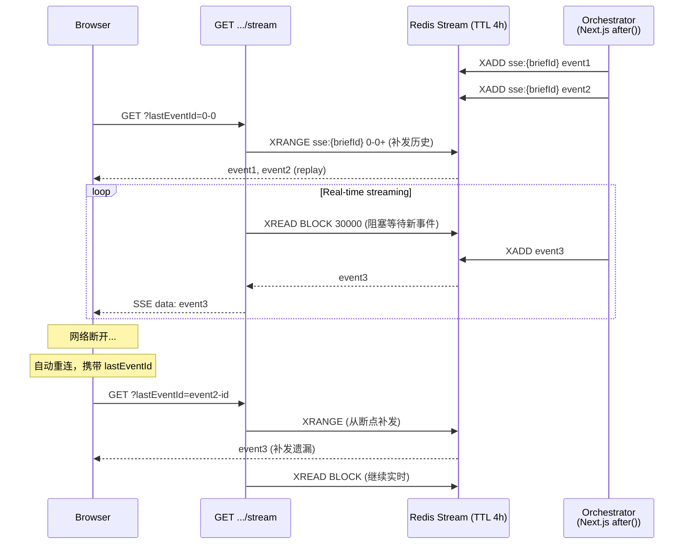

**设计要点：**
- SSE 事件持久化到 Redis Stream（4h TTL），断线重连自动从 `lastEventId` 补发
- `after()` (Next.js) 让编排在 HTTP 响应返回后异步执行，不阻塞请求
- `XREAD BLOCK` 使用独立 Redis 连接，避免阻塞主连接池

---

## Data Model

### Core Tables (ER Diagram)

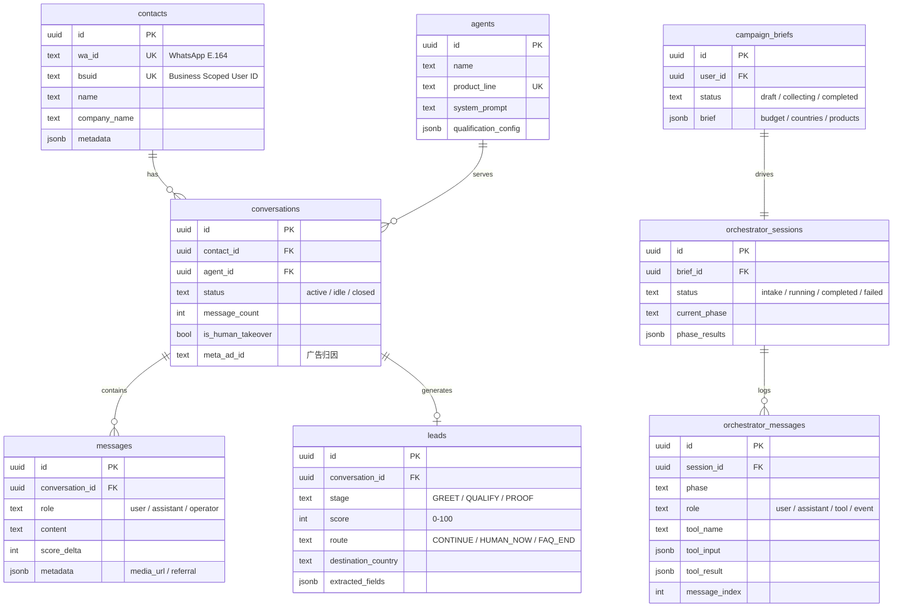

### Knowledge Base Tables

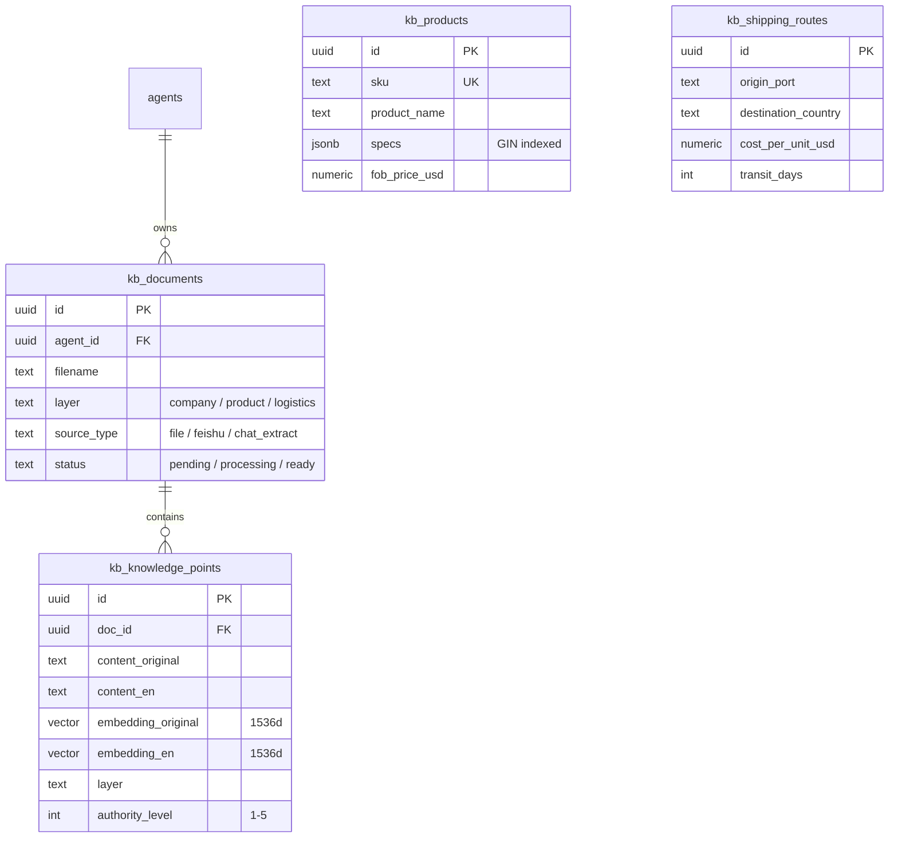

### Key Design Patterns

| 模式 | 说明 |
|------|------|
| **双标识符联系人** | `wa_id` + `bsuid` 至少一个非空，查询时 bsuid 优先 |
| **消息聚合队列** | `message_queue` + `SELECT FOR UPDATE SKIP LOCKED` 分布式锁 |
| **对话 Agent 作用域** | 同联系人 × 同 Agent 最多 1 个活跃对话（部分唯一索引）|
| **pgvector 双语嵌入** | `kb_knowledge_points` 中英文双向量，分层 RPC 检索 |
| **级联失效** | 编排上游阶段重跑 → 自动 delete 下游 `phase_results` |

---

## PM2 Process Model

生产环境由 PM2 管理 5 个常驻进程，配置见 `ecosystem.config.cjs`：

```
┌──────────────────────────────────────────────────────────────┐
│  PM2 Daemon                                                  │
│                                                              │
│  ┌────────────────────────┐  Port 3002, fork, max 1GB        │
│  │  1. lead-engine-next   │  Next.js 主进程                  │
│  └────────────────────────┘                                  │
│  ┌────────────────────────┐  setInterval 30s, max 256MB      │
│  │  2. lead-sync-cron     │  线索同步                        │
│  └────────────────────────┘                                  │
│  ┌────────────────────────┐  setInterval 10s, max 256MB      │
│  │  3. queue-cron         │  消息队列兜底                     │
│  └────────────────────────┘                                  │
│  ┌────────────────────────┐  每分钟检查, 08:00 CST 触发       │
│  │  4. report-cron        │  AI 报告生成                     │
│  └────────────────────────┘                                  │
│  ┌────────────────────────┐  setInterval 60s, max 256MB      │
│  │  5. orchestrator-recovery│ 编排会话恢复                   │
│  └────────────────────────┘                                  │
│                                                              │
│  日志: logs/{app,lead-sync,queue-cron,report-cron,           │
│              orchestrator-recovery}-{out,error}.log           │
└──────────────────────────────────────────────────────────────┘
```

### Process 1: `lead-engine-next` — Next.js 主进程

Next.js App 本身，承载所有前端页面渲染（SSR/RSC）和 API Route Handlers。

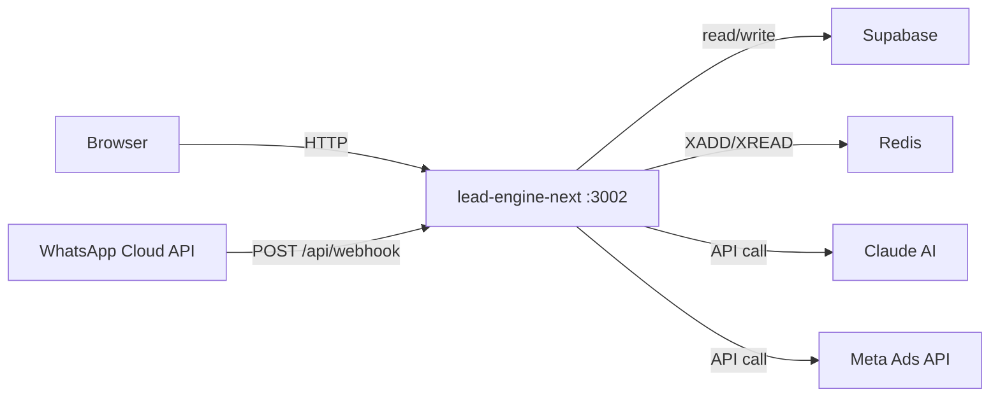

**职责：**
- 前端页面 SSR + 静态资源服务
- 所有 API Routes（~60 个），包括 WhatsApp Webhook 接收、Campaign SSE 推流、CRUD 等
- Campaign Orchestrator 的实际执行体（通过 `after()` 异步运行，不阻塞 HTTP 响应）
- 对外唯一暴露端口（3002），4 个 cron 进程均通过 HTTP 调用此进程的 `/api/cron/*` 端点

### Process 2: `lead-sync-cron` — 线索同步到外部 SCM

**脚本：** `scripts/cron-sync-leads.js` → `POST /api/cron/sync-leads`

每 30 秒将运营人员审核通过（approved）的线索同步到外部 SCM 系统（REVO）。

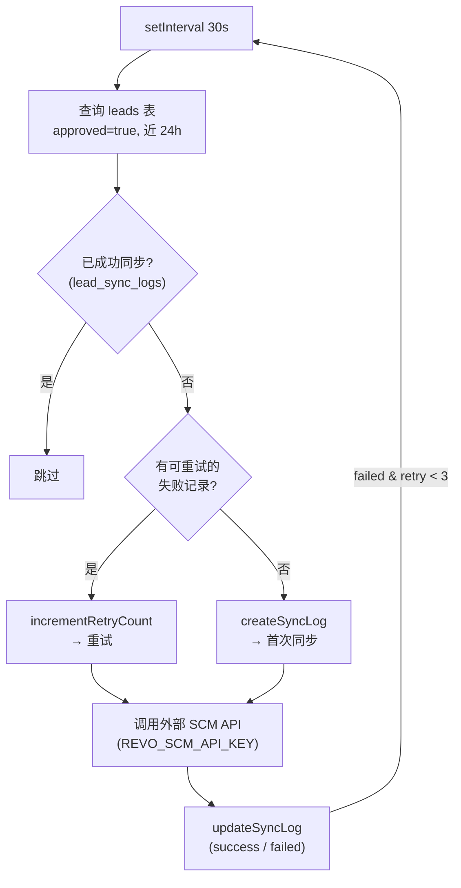

**内部逻辑：**
1. 查询 `leads` 表中 `approved=true` 且近 24h 的记录
2. 对比 `lead_sync_logs` 表，过滤已成功同步的，识别可重试的失败记录
3. 调用外部 REVO SCM API 批量推送（每批最多 100 条）
4. 将同步结果（success/failed/external_id）写回 `lead_sync_logs`
5. 失败记录保留，下一轮自动重试（最多 3 次）

### Process 3: `queue-cron` — 消息队列兜底处理

**脚本：** `scripts/cron-process-queue.js` → `GET /api/cron/process-queue`

每 10 秒扫描 `message_queue` 表，处理因 Webhook 回调丢失或进程崩溃而未消费的消息。这是消息处理链路的**兜底保障**——正常情况下消息由 Webhook 直接触发处理。

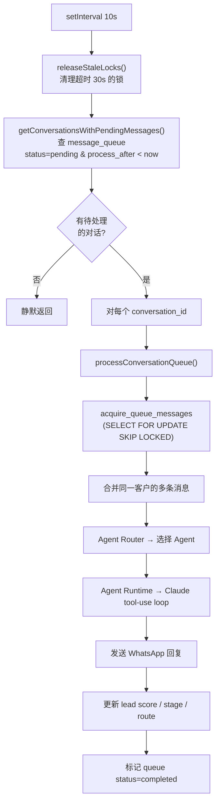

**内部逻辑：**
1. `releaseStaleLocks()` — 通过 RPC 释放锁定超过 30s 的任务（处理进程崩溃场景）
2. 查询 `message_queue` 中 `status=pending` 且 `process_after < now` 的对话
3. 对每个对话调用 `processConversationQueue()`：
   - 原子获取任务（`SELECT FOR UPDATE SKIP LOCKED`，多实例安全）
   - 聚合同一客户的连续消息为一次 LLM 调用
   - Agent Router 选择产品线 Agent → Agent Runtime 执行多轮 tool-use
   - 发送 WhatsApp 回复，更新线索评分，高意向触发飞书通知

### Process 4: `report-cron` — AI 报告自动生成

**脚本：** `scripts/cron-generate-reports.js` → `POST /api/cron/generate-reports`

每分钟检查时间，在每天 **08:00 CST（北京时间）** 触发一次报告生成。根据日期自动决定生成哪些类型的报告。

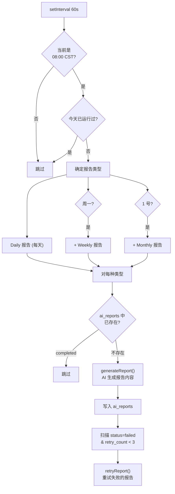

**内部逻辑：**
1. 每分钟检查是否到达 08:00 CST，防止重复执行（`lastRunDate` 去重）
2. 根据星期和日期确定生成类型：Daily（每天）、Weekly（周一）、Monthly（1 号）
3. 对每种类型调用 `generateReport()`，AI 分析询盘/线索/广告数据生成报告
4. 去重：`ai_reports` 表 UNIQUE `(type, period_start, period_end)` 防止重复
5. 自动重试：扫描 `status=failed` 且 `retry_count < 3` 的历史失败报告

### Process 5: `orchestrator-recovery` — Campaign 编排会话恢复

**脚本：** `scripts/cron-recover-orchestrator.js` → `GET /api/cron/recover-orchestrator`

每 60 秒扫描卡住的 Campaign 编排会话（服务器崩溃、超时等），从断点自动恢复。

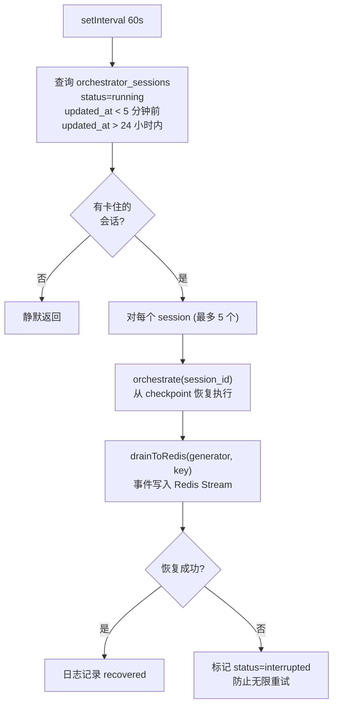

**内部逻辑：**
1. 查询 `orchestrator_sessions` 中 `status=running` 且 `updated_at` 超过 5 分钟的会话（卡住判定）
2. 排除超过 24 小时的会话（过旧不再恢复），每轮最多处理 5 个
3. 调用 `orchestrate(sessionId)` — 编排器内置断点恢复逻辑，读取 `phase_results` 跳过已完成阶段
4. 事件通过 `drainToRedis()` 写入 Redis Stream，前端 SSE 重连后可自动接收
5. 恢复失败的会话标记为 `interrupted`，避免下一轮继续重试造成循环

### 进程间通信关系

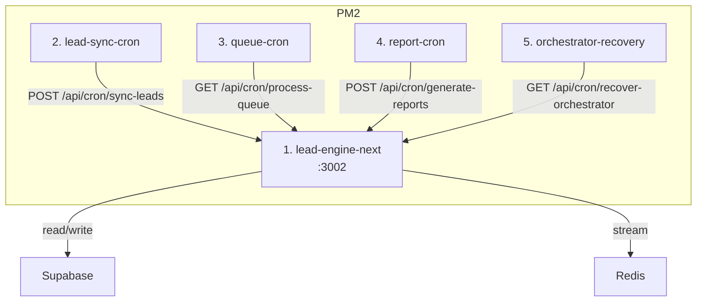

> **设计说明：** 4 个 cron 进程本身不包含业务逻辑，仅作为定时触发器通过 HTTP 调用主进程的 `/api/cron/*` 端点。这样做的好处是：业务逻辑集中在一个进程中维护，cron 进程无需加载 Next.js 也无需直连数据库，且可通过浏览器手动调用同一端点进行测试。

---

## Quick Start

### Prerequisites

- Node.js >= 18
- Redis (local or remote)
- Supabase project (migrations applied)

### 本地开发

```bash
# 安装依赖
npm install --legacy-peer-deps

# 配置环境变量
cp .env.demo .env.local
# 编辑 .env.local 填入实际密钥 (参考下方环境变量表)

# 数据库迁移
# 在 Supabase Dashboard 或 CLI 中执行 supabase/migrations/ 下的 SQL

# 启动开发服务器
npm run dev          # http://localhost:3002

# (可选) 启动后台进程
npm run cron:start   # lead-sync
npm run queue:start  # queue-processor
```

### 部署

```bash
npm run deploy       # 打包 → scp → 远程构建 → PM2 全量重启
```

### 测试

```bash
npm test             # Vitest 单元测试
```

---

## Environment Variables

完整配置见 `src/config.js`，关键变量：

| 变量 | 用途 | 必填 |
|------|------|------|
| `NEXT_PUBLIC_SUPABASE_URL` | Supabase 项目 URL | Yes |
| `NEXT_PUBLIC_SUPABASE_PUBLISHABLE_DEFAULT_KEY` | Supabase Anon Key | Yes |
| `SUPABASE_SERVICE_ROLE_KEY` | Supabase Service Role (server only) | Yes |
| `OPENROUTER_API_KEY` | OpenRouter API Key (LLM + AIGC) | Yes |
| `WA_TOKEN` | WhatsApp Cloud API Token | Yes |
| `WA_PHONE_NUMBER_ID` | WhatsApp 发送号码 ID | Yes |
| `WA_VERIFY_TOKEN` | Webhook 验证令牌 | Yes |
| `REDIS_URL` | Redis 连接地址 | Yes |
| `META_SYSTEM_TOKEN` | Meta Marketing API Token | Campaign |
| `META_AD_ACCOUNT_ID` | Meta 广告账户 ID | Campaign |
| `FIRECRAWL_API_KEY` | Firecrawl 网页抓取 | Campaign |
| `SERPAPI_KEY` | SerpAPI Google Trends | Campaign |
| `OPENAI_API_KEY` | Whisper 语音转文字 | Optional |
| `DEMO_MODE` | `true` 跳过登录 | Optional |

---

## Development Conventions

- **改数据库 Schema** — 新建 `supabase/migrations/NNN_xxx.sql`，不直接在控制台改
- **新增字段前先查表关系** — 能用 JOIN 就不加冗余列（见 `CLAUDE.md`）
- **`src/` 不 import React/Next** — 必须对 runtime 中立，能被脚本和 API 同时调用
- **测试必须真跑** — 不能只做静态 review（见 `CLAUDE.md`）
- 更多约定见 `CLAUDE.md`
