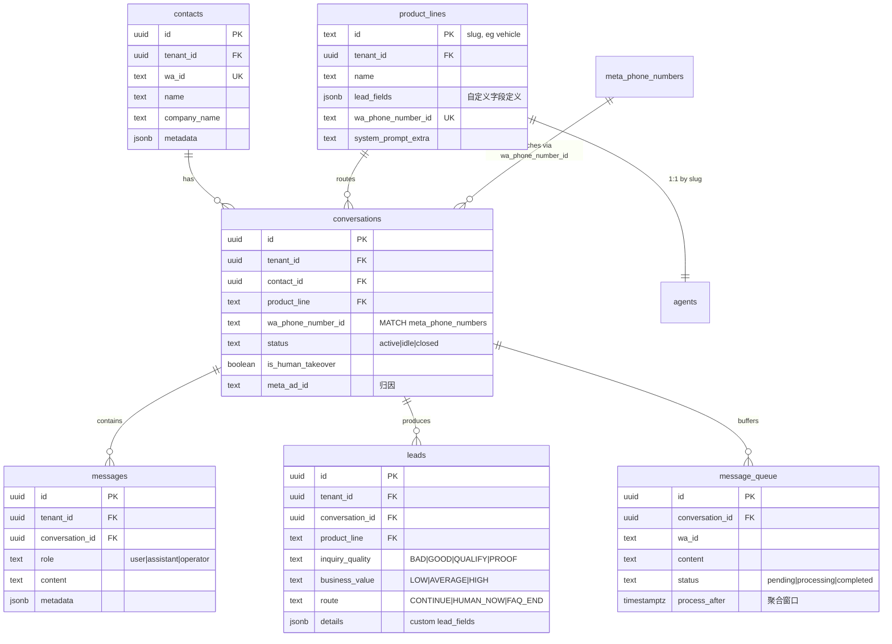
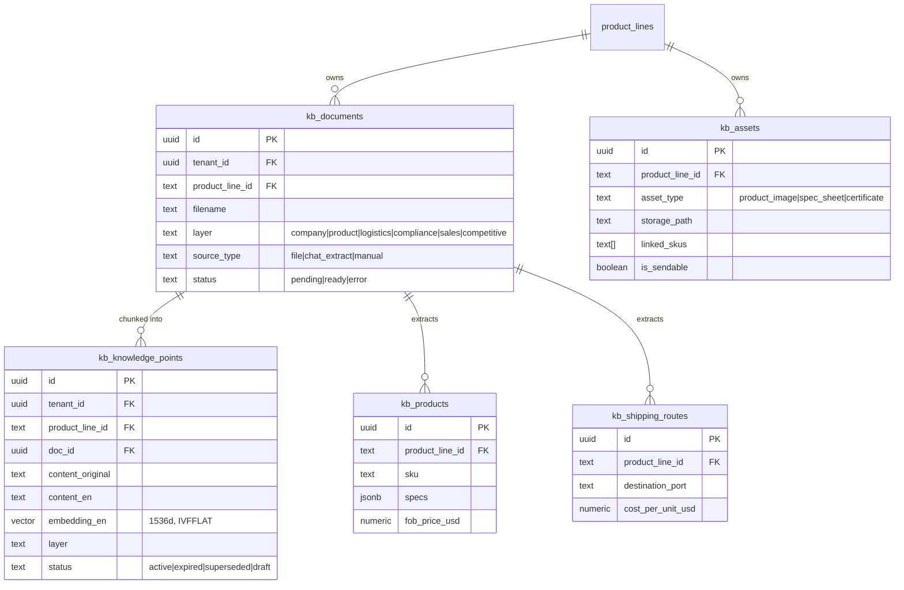
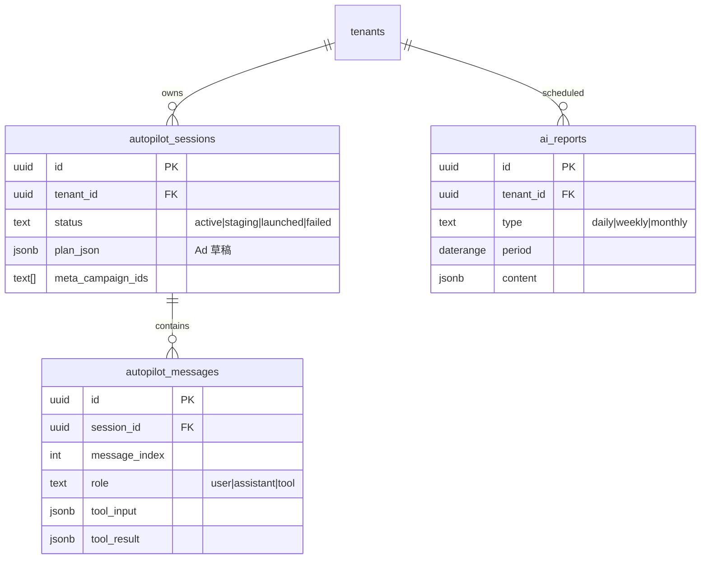
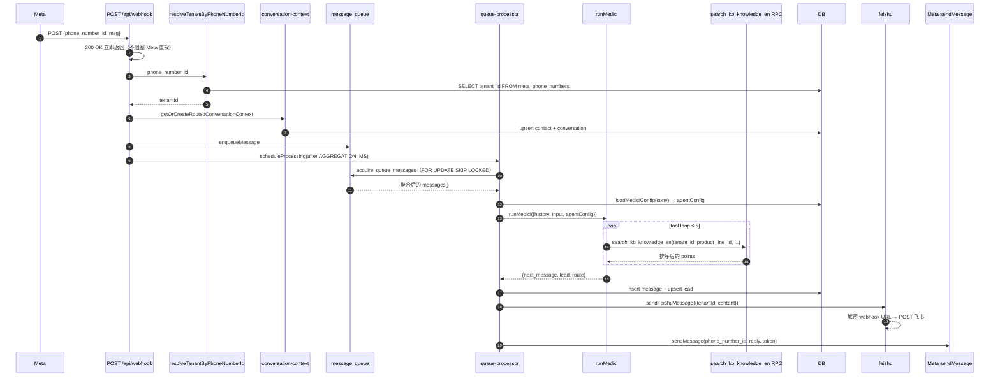
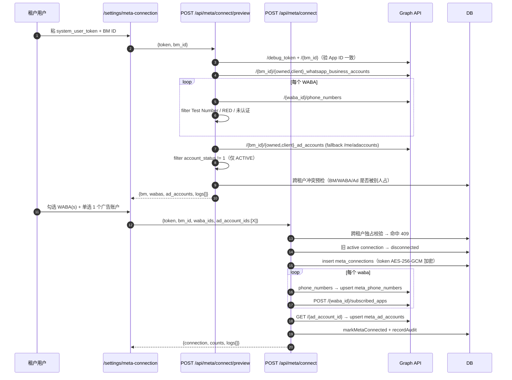
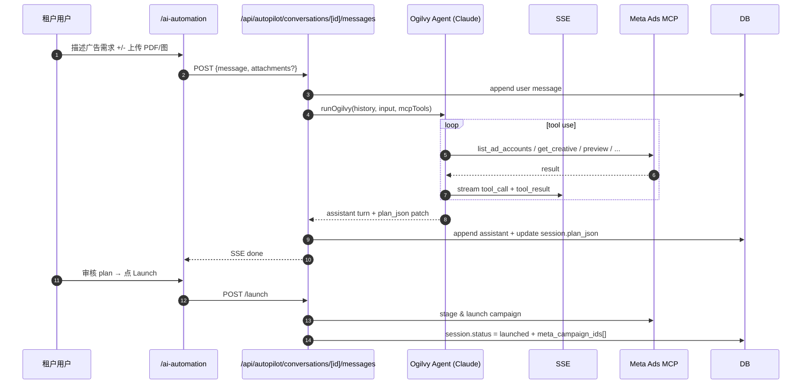

# LeadEngine

**多租户邀请制 SaaS：WhatsApp 询盘自动化 + Click-to-Chat 广告编排。**

每个租户接入自己的 Meta Business Manager，平台跑两个 Claude Agent：
- **Medici** — 入站 WhatsApp 自动应答 + 资格化询盘
- **Ogilvy / Autopilot** — 对话式生成 Click-to-WhatsApp 广告，一键投放到 Meta

---

## 目录

- [技术栈](#技术栈)
- [系统架构](#系统架构)
- [前后端骨架](#前后端骨架)
- [数据模型](#数据模型)
- [核心流程](#核心流程)
- [开发 / 测试 / 部署](#开发--测试--部署)
- [工程约定](#工程约定)

---

## 技术栈

| 层 | 选型 | 版本 |
|---|---|---|
| 框架 | Next.js（App Router · JS） | 16.x |
| UI | React + Tailwind CSS | 18 / 4.x |
| DB / Auth | Supabase（Postgres + RLS + Realtime + Storage） | js-sdk 2.45 |
| LLM | Anthropic Claude（via OpenRouter）+ OpenAI Embeddings | Sonnet 4.x · text-embedding-3-small |
| 向量检索 | pgvector（`kb_knowledge_points.embedding_en` 1536d, IVFFLAT） | — |
| 队列 | Postgres `message_queue` + `FOR UPDATE SKIP LOCKED` | — |
| 缓存 / SSE | ioredis | 5.x |
| 通知 | 飞书自定义机器人 webhook（per-tenant） | — |
| 进程 | PM2（app + 3 cron） | — |

---

## 系统架构

```mermaid
flowchart TB
  subgraph Ext["外部"]
    META[Meta Graph API<br/>WhatsApp + Ads]
    LARK[飞书自定义机器人]
    OPR[OpenRouter / Anthropic]
    OAI[OpenAI Embeddings]
  end

  subgraph App["LeadEngine（Next.js + 3 cron）"]
    direction TB
    UI[Dashboard SSR/CSR<br/>app/&#40;app&#41;/*]
    API[REST API<br/>app/api/**/route.js]
    WH[/POST /api/webhook<br/>WhatsApp 入站/]
    CRON[PM2 crons:<br/>process-queue · sync-leads · generate-reports]

    subgraph Domain["lib + src 业务层"]
      direction LR
      TENANT[tenant-context]
      META_CONN[meta-connection<br/>repo + AES-256-GCM]
      QUEUE[queue-processor]
      MEDICI[Agent · Medici]
      OGILVY[Agent · Ogilvy/Autopilot]
      KB[kb-search]
      FEISHU[feishu.service]
    end

    UI --> API
    WH --> QUEUE
    CRON --> QUEUE
    API --> TENANT
    QUEUE --> MEDICI
    MEDICI --> KB
    MEDICI --> FEISHU
    UI --> OGILVY
    OGILVY --> META
  end

  subgraph DB["Supabase Postgres"]
    AUTH[(auth.users)]
    TENANTS[(tenants · users · invitations<br/>onboarding · audit_log)]
    BIZ[(contacts · conversations · messages · leads<br/>product_lines · agents · kb_*)]
    META_T[(meta_connections<br/>meta_phone_numbers · meta_ad_accounts)]
    NOTIF[(notification_settings)]
    QT[(message_queue)]
  end

  WH -.verify.-> META
  MEDICI -.reply.-> META
  MEDICI -.LLM.-> OPR
  KB -.embed.-> OAI
  FEISHU -.notify.-> LARK
  TENANT --> AUTH
  Domain --> DB
```



**关键边界：**
- 每条 API 路由开头都过 `getTenantContext()`（webhook 走 `resolveTenantByPhoneNumberId()`）。无 demo 模式、无 env 兜底，拿不到 tenant 直接 401。
- 跨租户隔离两层：业务代码主动 `.eq('tenant_id', ctx.tenantId)` + RLS `tenant_id = (SELECT tenant_id FROM users WHERE id = auth.uid())`。
- `meta_connections.system_user_token_encrypted` / `notification_settings.feishu_webhook_url_encrypted` 全部 AES-256-GCM 落 bytea，密钥来自 `META_TOKEN_ENCRYPTION_KEY`。
- KB 检索按 `(tenant_id, product_line_id)` 索引，Medici 工具不依赖 agent UUID 桥。

---

## 前后端骨架

```
LeadEngine/
├─ app/
│  ├─ (app)/                    已登录页面
│  │  ├─ admin/                   founder-only：邀请 / 租户管理
│  │  ├─ ai-automation/           Autopilot 对话 UI
│  │  ├─ analytics/ reports/      数据看板 / 报表
│  │  ├─ campaign-studio/         投放数据
│  │  ├─ leadhub/                 询盘工作台
│  │  ├─ product-lines/[id]/      产品线 CRUD + 知识库 tab
│  │  ├─ settings/{meta-connection,notifications}
│  │  └─ dev-tools/               founder-only：SQL / Medici 模拟器
│  ├─ (auth)/{login,signup}/    公开
│  ├─ api/**/route.js           REST API（每条都 getTenantContext）
│  └─ components/               共享 UI
├─ lib/                         应用层
│  ├─ tenant-context.js           getTenantContext / resolveTenantByPhoneNumberId
│  ├─ founder-id.js               FOUNDER_TENANT_ID（client-safe 纯常量）
│  ├─ meta-token-crypto.js        AES-256-GCM
│  ├─ supabase{,-server,-browser,-admin}.js
│  ├─ queue-processor.js          message_queue → runMedici 主循环
│  ├─ conversation-context.service.js
│  ├─ meta-bm-resolver.js
│  └─ repositories/               所有 supabase.from(...) 收口
├─ src/                         领域服务
│  ├─ config.js                   ★ 唯一读 process.env 的入口
│  ├─ agents/medici/              入站 Agent（runMedici / kb-tools / config）
│  ├─ agents/ogilvy/              Autopilot Agent
│  ├─ kb-search.service.js        searchKnowledge（vector / structured / hybrid）
│  ├─ kb-upload.service.js        文件解析 → 向量入库
│  ├─ feishu.service.js           per-tenant webhook 通知
│  ├─ whatsapp.service.js         WA Cloud API（5 分钟 token 缓存）
│  ├─ whisper.service.js          OpenAI Whisper 音频转写
│  └─ llm-client.js               OpenRouter / Anthropic 统一封装
├─ scripts/                     PM2 入口 + 一次性数据脚本
└─ ecosystem.config.cjs         PM2 4 进程
```

### 路由模式

每条 API 都是同一个骨架：

```js
export async function POST(request) {
  const ctx = await getTenantContext();
  if (!ctx) return NextResponse.json({ error: 'Unauthorized' }, { status: 401 });
  // founder-only 路由再加一道：
  // if (ctx.tenantId !== FOUNDER_TENANT_ID) return 403;

  // 业务逻辑：所有 query .eq('tenant_id', ctx.tenantId)
}
```

`/api/webhook` 是唯一例外 —— Meta 不带用户身份，靠 `phone_number_id` 反查 tenant。

### 前端模式

`(app)/layout.js` 是 client component，挂 Sidebar + MetaConnectionBanner。Sidebar 客户端拉 `users.tenant_id` 跟 `FOUNDER_TENANT_ID` 比对：
- founder → 只显示「平台管理」 + dev-tools
- 普通租户 → 业务模块 + Meta 连接 / 通知

`(app)/page.js` 是 server component 做根路径分发：founder → `/admin/tenants`，租户 → `/analytics`。

---

## 数据模型

### 账号 + Meta 连接

```mermaid
erDiagram
  tenants ||--o{ users : "has"
  tenants ||--o{ invitations : "issued by"
  tenants ||--|| onboarding_progress : "1:1"
  tenants ||--|| notification_settings : "1:1"
  tenants ||--o{ audit_log : "records"
  tenants ||--o{ meta_connections : "has"
  meta_connections ||--o{ meta_phone_numbers : "syncs"
  meta_connections ||--o{ meta_ad_accounts : "syncs"

  tenants {
    uuid id PK
    text name
    text slug UK
    text status "active|suspended|deleted"
  }
  users {
    uuid id PK_FK_auth
    uuid tenant_id FK
    text email
    text role "owner"
  }
  invitations {
    uuid id PK
    text email
    text token UK
    timestamptz expires_at
    text status "pending|accepted|expired|revoked"
  }
  onboarding_progress {
    uuid tenant_id PK_FK
    timestamptz meta_connected_at
    timestamptz first_kb_uploaded_at
    timestamptz first_message_received_at
  }
  notification_settings {
    uuid tenant_id PK_FK
    bytea feishu_webhook_url_encrypted "AES-256-GCM"
    boolean feishu_enabled
  }
  meta_connections {
    uuid id PK
    uuid tenant_id FK "UNIQUE WHERE status=active"
    text bm_id "GLOBAL UNIQUE WHERE status=active"
    bytea system_user_token_encrypted "AES-256-GCM"
    text status "active|disconnected|revoked"
  }
  meta_phone_numbers {
    text phone_number_id PK
    uuid tenant_id FK
    uuid meta_connection_id FK
    text waba_id "TENANT-EXCLUSIVE via trigger"
    text display_number
    text quality_rating
  }
  meta_ad_accounts {
    text ad_account_id PK
    uuid tenant_id FK
    int account_status "1=ACTIVE only"
  }
```

**跨租户独占规则**：`bm_id` / `waba_id` / `phone_number_id` / `ad_account_id` 任一时刻只能归属一个租户，DB 层面通过 partial unique index + trigger 强制保证。

### 业务核心



### 知识库 v2

KB 表统一按 `(tenant_id, product_line_id)` 索引。`product_line_id` 是 `product_lines.id` (slug)，写入时由 trigger 从 `agent_id` 自动反查兜底。



### Autopilot 与报表



---

## 核心流程

### Flow 1 · 入站 WhatsApp → Lead



### Flow 2 · Meta 接入两步向导



### Flow 3 · Autopilot



---

## 开发 / 测试 / 部署

### 一次性环境

```bash
nvm use 22 && npm install
cp .env.local.example .env.local && $EDITOR .env.local
npm run dev   # next dev -p 3002
```

### `.env.local` 必填项

| 变量 | 用途 |
|---|---|
| `NEXT_PUBLIC_SUPABASE_URL` / `NEXT_PUBLIC_SUPABASE_PUBLISHABLE_DEFAULT_KEY` | Supabase 客户端 |
| `SUPABASE_SERVICE_ROLE_KEY` | service-role client |
| `META_TOKEN_ENCRYPTION_KEY` | 64 字符 hex（`node -e "console.log(require('crypto').randomBytes(32).toString('hex'))"`） |
| `META_APP_ID` / `META_APP_SECRET` | 平台 Meta App |
| `META_API_VERSION` | 默认 `v21.0` |
| `OPENROUTER_API_KEY` / `OPENAI_API_KEY` | LLM + embeddings |
| `CRON_SECRET` | cron 路由 Bearer 鉴权（必填，否则 401） |
| `NEXT_PUBLIC_APP_URL` | 自身 URL（邀请链接、webhook callback） |

### 常用命令

```bash
npm run dev      # 本地启动（3002）
npm run build    # 生产构建
npm run start    # 生产启动
npm run lint     # next lint
npm run deploy   # rsync + 远端 npm ci + build + pm2 reload
```

### 测试关键路径

| 场景 | 怎么测 |
|---|---|
| 入站 WhatsApp | 真号给绑定的 phone_number_id 发消息；或在 `/dev-tools/medici-simulator` 选定 product_line 后发消息看 trace |
| Meta 连接 | `/settings/meta-connection` 粘 token + BM ID，preview 步骤的 logs 面板可见每步 Graph API 调用 |
| 飞书通知 | `/settings/notifications` 配自定义机器人 webhook → 点测试 |
| 邀请注册 | founder 在 `/admin/invitations` 生成链接 → 隐身窗口走 signup |
| KB 检索 | `/dev-tools/medici-simulator` trace 里能看到 `search_knowledge` tool_call + tool_result |

### PM2（4 进程）

[ecosystem.config.cjs](ecosystem.config.cjs)：

| Process | 入口 | 周期 |
|---|---|---|
| `lead-engine-next` | `next start -p 3002` | 常驻 |
| `queue-cron` | `scripts/cron-process-queue.js` | 每分钟 |
| `lead-sync-cron` | `scripts/cron-sync-leads.js` | 每 5 分钟 |
| `report-cron` | `scripts/cron-generate-reports.js` | 每天 |

cron 进程通过 HTTP 调本机 `/api/cron/*`，带 Bearer `CRON_SECRET`。**`CRON_SECRET` 没配则全 401**（防 env 漏配后裸奔的反模式）。

---

## 工程约定

1. **`process.env.XXX` 只能在 [src/config.js](src/config.js) 读**。其他文件一律 `import { config } from '@/src/config'`。唯一例外 [lib/supabase-browser.js](lib/supabase-browser.js)（浏览器不能走 config 层）。
2. **不要过度设计**。1 user = 1 tenant，没团队、没角色 ABAC。
3. **单一路径无 fallback**。`getTenantContext()` 拿不到就 401，不自愈；`CRON_SECRET` 没配 cron 一律 401。
4. **数据库改造永远向后兼容**。新功能用新列 / 新 overload / 新表，老接口保留不删，DB 旧数据不动。
5. **每个仓储函数 tenant-aware**。例：`findActiveConversation({ tenantId, contactId })`，缺 tenantId 直接 throw。
6. **Founder gate**：`/admin/*` + `/dev-tools/*` 路由额外 `ctx.tenantId === FOUNDER_TENANT_ID` 检查；普通租户 sidebar 也看不到这些入口。
7. **加密**：Meta token + 飞书 webhook URL 都走 AES-256-GCM 落 bytea，密钥 `META_TOKEN_ENCRYPTION_KEY` 不可旋转（旋转会让历史行无法解密）。
8. **聚合窗口**：webhook 入队后等 `QUEUE_AGGREGATION_MS`（默认 2s）再触发处理，让连续短消息合并送给 LLM。

---

**License**: Proprietary · **Maintainer**: Founder
