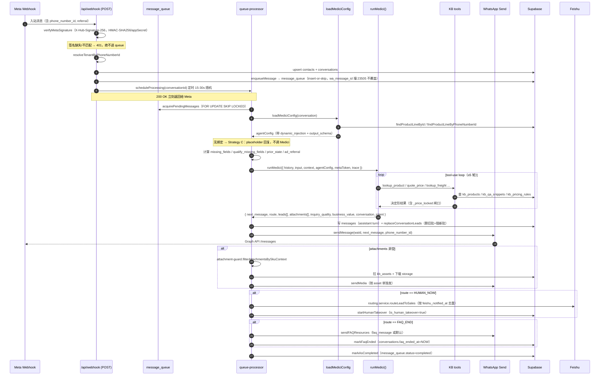
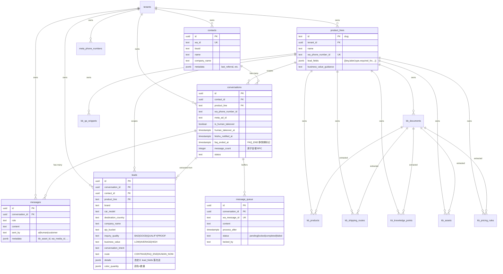

# Medici — 产品与工程架构设计说明

> 文档版本：2026-05-17 · 与代码同步（main 分支）
> 代码位置：`src/agents/medici/`、`skills/ai-reception-deal/`、`lib/queue-processor.js`、`src/routing.service.js`、`app/api/webhook/`

---

## 0. 一句话定位

**Medici 是 LeadEngine 的"接待—成交"对话 Agent**——客户在 WhatsApp 上发来的每一条消息，由 Medici 在同一轮里**回话 + 抽线索 + 评估意图/质量/价值 + 决定路由**。命名取自佛罗伦萨美第奇家族——同一条对话里同时做银行业务与外交（reply + qualify），这正是这个 agent 的形态。

它不是一个独立服务，而是一个**沿"webhook → 消息队列 → 路由 → Medici → 出站 + 持久化"调用链**插在中间的纯函数式 LLM orchestrator：

```
Meta Webhook → message_queue → queue-processor → loadMediciConfig
                                                    ↓
              [history/context/agentConfig/tools] → runMedici()
                                                    ↓
        ┌──────────────────────────────────────────────┐
        │  next_message + route + leads[] +            │
        │  attachments[] + inquiry_quality +           │
        │  business_value + handoff_summary            │
        └──────────────────────────────────────────────┘
              ↓                          ↓
       WhatsApp 出站消息            replaceConversationLeads（删旧批+插新批）
       attachment 单独发图          Feishu 推送 + 人工接管
```

---

## 1. 产品角色与边界

### 1.1 它要做的事

| 能力 | 含义 |
|---|---|
| **回话** | 用客户能接受的口吻、长度（≤180 字符）、节奏（一次推进 1–2 个关键问题）回复 |
| **抽线索** | 每轮**复盘整段对话历史**，按 product_line 配置的 `lead_fields` 输出结构化 leads |
| **评估** | 为每个会话打标签：`conversation_intent` / `inquiry_quality` / `business_value` |
| **路由** | 决定 `CONTINUE`（继续 AI 谈）/ `FAQ_END`（C 端答完结）/ `HUMAN_NOW`（转人工） |
| **被动外发图片** | 客户**明确要图**时挑一张 KB 资产挂在 `attachments` 里 |

### 1.2 它故意不做的事

- 不主动推销、不发图、不夸张承诺
- 不发起 outbound 营销
- **不报价**——价格全部经过 KB 工具（`quote_price` / `lookup_product`）；KB 不返回价就转人工
- 不处理订单、不签合同、不收款
- 不写本地文件、不调任意第三方 API——只能用宿主提供的 8 个工具

### 1.3 多业务线通用

skill 主体 (`ai-reception-deal`) **不假设业务领域**——整车、农机、汽配、化工、机械都跑同一个 skill。差异化通过 `product_lines` 表里这几列从动态段注入：

- `name` / `business_value_guidance` / `lead_fields[]`（含 `required_for: GOOD/QUALIFY/PROOF` 分层）
- 对应 KB 资产（`kb_products` / `kb_shipping_routes` / `kb_knowledge_points` / `kb_qa_snippets` / `kb_pricing_rules` / `kb_assets`）

---

## 2. 系统位置

Medici 是 Next.js 后端调用链中的一环，被两个入口调用：

| 入口 | 用途 |
|---|---|
| `lib/queue-processor.js` | 生产路径——WhatsApp 入站消息批量落地后调用 |
| `app/api/medici-simulator/send/route.js` | UI 模拟器——产品线详情页的 Medici 试聊面板，用来在不发 WhatsApp 的情况下体验当前 product_line 配置 |

两个调用都走同一份 `runMedici()`。

---

## 3. 模块拆解

`src/agents/medici/` 下 8 个文件，没有子目录——这是有意的"小目录大职责"：

| 文件 | 职责 |
|---|---|
| `index.js` | 主编排：拼装 system blocks / messages / tools，跑 tool-use loop，归一输出 |
| `config.js` | 把 `product_lines` 表行 → `agentConfig`（动态注入 + JSON schema + 资格规则）；60s 进程内缓存 |
| `output-schema.js` | `submit_response` envelope 真源——枚举 / 必填字段 / 通用回退 schema |
| `kb-tools.js` | 6 个 KB typed tool 的 wire-up + 报价闸口（`_price_locked`）+ gap 记录 |
| `skill-host-patch.md` | **宿主补丁**——附在 skill 之后，定义 envelope 解读 / 阶段映射 / 特殊路由 / 风格底线 |
| `attachment-guard.js` | 出图前的 SKU 上下文匹配——避免把 A 车型的图发给问 B 车型的客户 |
| `send-attachments.js` | 真正调 WhatsApp 媒体接口把图发出去 + 写 assistant message |
| `types.md` | 文档：runMedici 的输入 / 输出 / 上下文约定 |

Skill bundle 在 `skills/ai-reception-deal/`：

```
skills/ai-reception-deal/
  SKILL.md                              # 方法论：6 阶段 SOP（inbound / lead_collection / dealing / negotiation / order_intent / human_handover）
  references/
    stages-definition.md                # 每阶段进入/退出条件、字段要求
    kb-usage-rules.md                   # KB 工具使用规则、not_found 处置
    tool-priority-rules.md              # lookup_product / quote_price / lookup_freight 的优先级
    handover-rules.md                   # 何时转人工、handoff_summary 要带什么
    response-style.md                   # WhatsApp 口吻、≤180 字、无 emoji
```

References **不进 system prompt**——agent 通过 `read_skill_reference({ name })` 工具按需拉取，省 ~10K token/轮。

---

## 4. 系统提示词（System Prompt）的三层结构

Medici 的 system 是 **3 个 cache block** 拼接的，这是它的成本与质量基石：

```
┌────────────────────────────────────────────────────────────────┐
│ [0] SYSTEM_STATIC（≈ 10K tokens，ephemeral cache_control）       │
│     = SKILL.systemPrompt + "\n---\n" + skill-host-patch.md      │
│     启动时一次性读盘并冻结；所有 tenant / 所有 product_line 共享   │
├────────────────────────────────────────────────────────────────┤
│ [1] PER_LINE_CONTEXT（变长，ephemeral cache_control）             │
│     = "产品线名称 + LEAD_FIELDS_HINTS + GOOD/QUALIFY/PROOF        │
│        必填字段 + BUSINESS_VALUE_GUIDANCE + AVAILABLE ASSETS"      │
│     每个 product_line 一份；跨会话稳定，缓存可命中所有客户          │
├────────────────────────────────────────────────────────────────┤
│ [2] PER_TURN_CONTEXT（小、不缓存）                                 │
│     = "CURRENT MISSING FIELDS + PRIOR STATE + Ad referral +     │
│        ATTACHMENTS ALREADY SENT"                                │
│     每轮变化；只占 几百 tokens                                     │
└────────────────────────────────────────────────────────────────┘
```

**为什么用两个 cache breakpoint 而不是一个**：Anthropic 通过 OpenRouter 的自动 prefix cache 只能给一个 break point；显式标 `cache_control` 能拿到两个，于是"产品线配置 + AVAILABLE ASSETS 列表"也能跨会话缓存。AVAILABLE ASSETS 可能挂 30 张图、每张描述 30–60 tokens，省一次就是几十次回本。

实现见 `index.js:237` (`buildSystemBlocks`) 和 `index.js:460` (`callClaude`)。

---

## 5. 输出 envelope：`submit_response`

每轮**必须以** `submit_response` 工具调用收尾——纯助手文本会被丢弃。envelope 字段固定，由 `output-schema.js::buildEnvelopeSchema` 拼装：

```json
{
  "conversation_intent": ["business_inquiry"],
  "conversation_intent_summary": "Bulk import inquiry for 50 units to Kenya...",
  "inquiry_quality": "GOOD",            // BAD / GOOD / QUALIFY / PROOF
  "business_value": "AVERAGE",          // LOW / AVERAGE / HIGH
  "leads": [
    {
      "product_name": "...",
      "destination_country": "Kenya",
      "company_name": "...",
      "qty_bucket": "20-50",
      "details": { /* 产品线特有字段 */ }
    }
  ],
  "route": "CONTINUE",                  // CONTINUE / FAQ_END / HUMAN_NOW
  "next_message": "Sure, could you share which model you're looking at?",
  "handoff_summary": "",                // route=HUMAN_NOW 时给销售的总结
  "attachments": [{ "asset_id": "uuid", "caption": "..." }]
}
```

枚举源：`INTENT_ENUM` / `INQUIRY_QUALITY_ENUM` / `BUSINESS_VALUE_ENUM` / `ROUTE_ENUM` ([src/agents/medici/output-schema.js:17](src/agents/medici/output-schema.js:17))。

`leads[].items` schema 来自 `agentConfig.output_schema`——由 `config.js::assembleOutputSchema(row)` 把 `product_lines.lead_fields` 编译成 JSON Schema。无自定义 schema 时回退 `GENERIC_LEAD_OUTPUT_SCHEMA`（车贸场景的通用字段集）。

---

## 6. 工具集

### 6.1 always-on

| 工具 | 作用 |
|---|---|
| `submit_response` | 收尾工具，每轮必调（强制） |
| `read_skill_reference` | 按需拉 references/*.md |

### 6.2 KB tools（仅当该 product_line 有 KB 内容时才挂载）

由 `kb-tools.js::buildKbTools` 决定挂不挂——`hasKnowledgeBase` 检查 `kb_knowledge_points` / `kb_qa_snippets` / `kb_products` 是否有该 product_line 的活跃数据，三者皆空 → 返回空数组（连工具都不告诉模型）。

| 工具 | 输入 | 返回 |
|---|---|---|
| `lookup_product` | sku / model / attrs（支持 `_lte`/`_gte` 区间） | `{found:true, products:[...]}` 或 `{found:false, suggestions?, missing_fields?}` |
| `quote_price` | sku, quantity, trade_term, destination_port, payment_term | `{ok:true, unit_price, total_price, breakdown, validity}` 或 `{ok:false, ...}` |
| `lookup_freight` | destination_port, shipping_method, origin_port | `{found:true, route:{...}}` 或 `{found:false, alternatives:[...]}` |
| `lookup_policy` | topic / free_text | `{found, answer_text, citations}`（含 QA snippet 命中） |
| `find_asset` | type / sku / view / color / scenario / natural_language | `{assets:[...]}` 含 `matched_by="tag"`（可放心转发）或 `"semantic"` |
| `check_constraint` | action（give_discount/accept_payment_term/...） | `{decision:"allowed"|"requires_approval"|"forbidden"|"unknown"}` |

**关键设计：每个工具都返回"决定形"结果**——`found:true/false`、`ok:true/false`、`decision:allowed/forbidden`——agent 走 if-else，**不**对相似度分数做软判断。这是 KB tool 与传统 RAG 的本质差异。

### 6.3 报价闸口（`_price_locked`）

这是 LeadEngine 业务红线的工程兜底，见 [src/agents/medici/kb-tools.js:226](src/agents/medici/kb-tools.js:226) 和 [skill-host-patch.md §10](src/agents/medici/skill-host-patch.md)：

**两种锁**：

1. **`reason: "leads_incomplete"`**——客户 leads 未齐到 QUALIFY 必填字段。
   - 工具调用前在 `executeKbTool` 里检查 `ctx.qualifyMissingFields`，非空 → 从 `lookup_product` 的 `products[]` / `lookup_freight` 的 `route` 里**剥掉**所有价格字段（启发式：key 匹配 `price/cost/quote/floor/ceiling/msrp/retail/wholesale/guide` 或以 `_usd/_cny/_eur/...` 结尾的都剥掉），并在结果上盖 `_price_locked` 标记。
   - `quote_price` 直接短路返回 `{ok:false, reason:"leads_incomplete"}`。

2. **`reason: "config_not_picked"`**——leads 齐了但 `lookup_product` 返回 >1 条 SKU。
   - 客户没选具体配置就给报价 → 模型会把所有 `fob_price_usd` 合并成 `$8,800–$12,600` 区间报出去。所以再加一道闸：未收敛到单条结果时同样剥价。

**模型行为约束**（skill-host-patch §10.3）：看到 `_price_locked` → 不许输出任何价格数字 / 区间 / "$X 起" / ballpark / "大概 $X"，只能列配置名问选哪个；客户硬推 → 转人工。

---

## 7. 主流程：`runMedici()`

入口签名（[src/agents/medici/index.js:579](src/agents/medici/index.js:579)）：

```js
runMedici({
  history,         // [{role, content, metadata}, ...]
  input,           // string | message | message[]
  context: { missing_fields, qualify_missing_fields, prior_state, ad_referral },
  agentConfig,     // 必须含 dynamic_injection、tenant_id、product_line
  metaToken,       // 用来下载入站 WhatsApp 媒体
  trace: { traceId, conversationId, waId },
  onToolEvent      // 可选 SSE 观测钩子（Medici 模拟器用）
})
```

执行步骤：

```
1. buildMessages(history, input)
   - 把历史里每条 message 转成 Anthropic content（文本 / image_url / 多块）
   - 入站图片 metadata.media_type=image → downloadWhatsAppMediaBuffer + base64 内联
   - 模拟器路径走 metadata.inline_image（已有 bytes，不下 Meta）
   - 最后一条历史消息打 cache_control（让"截止上一轮"的历史缓存可复用）

2. resolveOutputSchema(agentConfig)
   - 产品线自定义 schema 优先；否则用 GENERIC_LEAD_OUTPUT_SCHEMA

3. 并行加载：
   - loadAgentTools(tenant, productLine)           → KB tools（按 KB 存在性挂载）
   - loadAvailableAssets(tenant, productLine)      → kb_assets is_sendable=true 列表
   再拼上 read_skill_reference + submit_response，给最末工具打 cache_control

4. buildSystemBlocks(SYSTEM_STATIC, perLine, perTurn)
   - 三段 system，前两段 cache_control

5. Tool-use loop（MAX_ITERATIONS = 5）：
   while finish_reason == 'tool_calls':
     - 收到的 tool_calls 同轮并行执行（Promise.all）
     - 若任一是 submit_response → 即刻短路，parsed = JSON.parse(args)，break
     - 否则把 assistant turn + 所有 tool_result 按调用顺序 push 进 messages
     - 再调一次 callClaude

6. Force-submit fallback：
   - 5 轮还没出 submit_response → 把所有未决 tool_call 用 {skipped:"Force submit"} 收尾
   - 加一条 user "Please call submit_response with your structured response now"
   - tool_choice: { type:'tool', name:'submit_response' } 再调一次

7. 归一：
   - 自定义 schema：normalizeAgentResponse(parsed) 处理 car_brand→brand / part_name→product_name 等旧别名；
                    把所有非空字段同时复制进 details（双写阶段，未来 details 是唯一源）
   - stripEmptyStringFields(leads)：去掉空字符串字段
```

`callClaude` 走 OpenRouter，pinned to `provider: { order: ['anthropic'], allow_fallbacks: false }`——避免 Bedrock 路径吃掉 `cache_control`。模型：`MODELS.SONNET`（当前 `claude-sonnet-4-6`）。

---

## 8. 上下游：完整的 WhatsApp 入站到出站流程

这是把 Medici 套在系统里的端到端流程。Mermaid 序列图：



### 关键约束

- **聚合窗口** 15-30s 随机（`config.queue.aggregationWindowMinMs/MaxMs` + `pickAggregationWindowMs`，每次 burst 摇一次共享 deadline）：客户连发 3 条碎片消息，Medici 只跑一次回复"这 3 句合起来"，节奏更像人类打字。
- **分布式锁**：`acquire_queue_messages(p_conversation_id, p_instance_id)` Postgres RPC 用 `FOR UPDATE SKIP LOCKED`，多实例 / 跨 dev+prod 安全；过期锁由 `release_stale_queue_locks(90s)` cron 释放。
- **enqueue 防 Meta 重投**：webhook redelivery（同 `wa_message_id`）走 insert-or-skip，**绝不覆盖**已存在行的 status/process_after，防止"行被锁住时被翻回 pending → 双 worker 并发跑 → 双发 WhatsApp"。
- **签名校验**：`/api/webhook` POST 必须带 Meta 签发的 `X-Hub-Signature-256`，否则 401。`META_APP_SECRET` 是 Meta App 后台 Settings → Basic 里的 App Secret。
- **Strategy C**：phone_number_id 没绑 product_line → 不调 Medici，发"已收到，工作时间会回复"占位 + 在 DB 留消息。
- **takeover 抑制**：`conversations.is_human_takeover=true` 且未过 1h TTL → 跳过 Medici，只存消息；下次入站消息走 `checkAndExpireTakeover` 即时检测过期、`release-takeovers` cron 端点做批量兜底（**当前未挂 PM2**，inline 已覆盖正常路径）。
- **FAQ_END 静默期**：Medici 判 `FAQ_END` 后 `conversations.faq_ended_at` 被置位；之后所有客户消息只入 messages 表、不再喂 Medici、不再回复（防 spam 循环烧钱）。**新 CTWA referral 进来视作新意图自动解封**；其他场景靠 3 天 idle 起新会话。
- **lead 替换语义**：每轮 Medici 输出后 `replaceConversationLeads`（[lib/repositories/lead.repository.js](lib/repositories/lead.repository.js)）对该会话执行"删旧批 + 插新批"全量替换，整对话天然就一组活 leads（按 `lead.id` 区分多 leads）。早期 `lead_key` + partial unique 索引设计已 DEPRECATED 2026-05-18（生产从未写入），等阶段 3 drop。
- **Plan A：落库后不重试**：`processMessageForConversation` 写完 messages/leads 后置 `aiReplyPersisted=true`；后续 sendMessage / sendMediciAttachments / executeConversationRouting 任何一步抛错都走 `markAsCompleted` 截断、记 `queue.delivery_failed_post_persist` 给 ops 兜底——避免重试时 Medici 再算一遍 + inbox 双写 + WhatsApp 双发。takeover / unbound-phone / FAQ_END 三个旁路也共用同样的"部分落库即截断"语义（见 `persistMessagesOnly`）。

---

## 9. 数据模型

Medici 直接读写的核心表：



完整 schema 见 [.claude/index/schema.md](.claude/index/schema.md)。

---

## 10. 路由决策

`route` 由 skill 内部按阶段决定（[skill-host-patch.md §3](src/agents/medici/skill-host-patch.md)），宿主 `src/routing.service.js` 只**消费** route 做后处理：

| route | 宿主动作 |
|---|---|
| `CONTINUE` | 把 `next_message` 发出去就完了 |
| `FAQ_END` | 发完 `next_message` 后再发一条 `faq_message`（product_line 自定义或默认）；置 `conversations.faq_ended_at` → 后续客户消息进入"只入库不喂 AI"静默期，直到新 CTWA referral 解封 |
| `HUMAN_NOW` | 跳过 next_message 发送（如果有的话），按 leads 一条条 `routeLeadToSales` → Feishu 推送 + `startHumanTakeover` |

特殊路由覆盖（skill-host-patch §5）：
- `personal_consumer` → 强转 `FAQ_END`，`inquiry_quality=BAD`
- `other`（垃圾）→ `FAQ_END`，`next_message` 留空
- 客户明说要人工 → `HUMAN_NOW`（无视 quality）
- `quote_price` 连续两次 `not_found` 或客户在报价失败后硬推"先来个大概" → `HUMAN_NOW`
- `_price_locked` + 客户硬推报价 → `HUMAN_NOW`

---

## 11. inquiry_quality 与 lead_fields 的关系

product_lines 里 `lead_fields[]` 每条都有 `required_for: 'GOOD' | 'QUALIFY' | 'PROOF'`。`config.js::assembleQualificationConfig` 把它们打成 tier 必填字段表：

```js
{
  GOOD:    { required_fields: ['product_name', 'destination_country'] },
  QUALIFY: { required_fields: ['company_name', 'qty_bucket'] },
  PROOF:   { required_fields: ['order_confirmation', 'payment_intent'] }
}
```

`src/inquiry-quality.js::getMissingFields(tier, leadData, ...)` 计算缺哪些字段。queue-processor 在调 runMedici 前算两遍：

- `missing_fields = getMissingFields(currentQuality, leadData)`：给模型看，当前层级还差啥
- `qualify_missing_fields = getMissingFields('QUALIFY', leadData)`：传给 KB tools 当报价闸口的依据

模型每轮回话和打 inquiry_quality 时都按这些字段集判断，跟"价格闸口"形成闭环：**只有到 QUALIFY 客户才能看到价格**。

---

## 12. 性能与成本

| 维度 | 当前做法 |
|---|---|
| **prompt cache** | 3 段 system + history 最后一条都打 `ephemeral`；产品线配置块跨会话共享 |
| **模型** | Claude Sonnet 4.6（1M context）via OpenRouter pinned Anthropic-direct |
| **聚合窗口** | 2–5s 把客户连发的短消息合一次跑，省掉重复 prefill |
| **KB tool 并发** | 同一轮的多 tool_call `Promise.all`，不串行 |
| **gap 写入** | `await` 但容错——~50ms 比一次 LLM turn 几乎可忽略，换"准确去重" |
| **token 计量** | 每次 LLM 调用走 `llm-client.js`，写一行 `llm_usage_logs`（含 `cache_creation_input_tokens` / `cache_read_input_tokens`） |

成本面板：`/admin/llm-usage` 直接读 `llm_usage_logs` 透视。

---

## 13. 可观测性

- **trace_id**：webhook 生成、贯穿整条调用链；`lib/core-trace.js::createTraceLogger`；查日志按 trace_id grep 一次性看完一条消息全过程
- **`llm_usage_logs.call_site`**：`medici.qualify`（主调用） / `kb.search.*`（KB 内部 embedding）
- **`onToolEvent`**：Medici 模拟器把每次 tool_call / tool_result 推到 SSE，UI 实时显示"AI 现在在查 lookup_product"
- **`messages.metadata`**：保留 `kb_asset_id` / `wa_media_id` / `score_delta` / `risk_flags`，方便 LeadHub 时间线复盘

---

## 14. 设计取舍

| 取舍 | 选择 | 理由 |
|---|---|---|
| **方法论 vs 宿主收口** | skill 给方法论、host-patch 给硬约束 | skill 文件改了热替换，宿主代码改动只在 dynamic context / tools / dispatcher 三处 |
| **每轮强制 submit_response** | 是 | 调用方永远拿到 schema 验证过的 JSON；纯文本助手回复一律丢 |
| **同轮并行工具调用** | 是 | 客户问"有这型号吗，到肯尼亚多少钱" 一轮调 lookup_product + lookup_freight + quote_price |
| **不允许在 KB 没结果时编造** | 是 | quote_price `not_found` → 转人工；`lookup_freight` `found:false` → 措辞固定为"可以发，运费让运营核" |
| **lead 双写 details** | 当前阶段 | DB 列与 details 同源；阶段 3 drop 列后只看 details |
| **assets 不分批** | 是 | AVAILABLE ASSETS 在 per-line cache 段里，写一次缓存读 N 次摊销 |
| **不用 vector RAG 直答** | 是 | KB tool 决定形结果可解释、可审计；vector 只在 KB 内部 search 里用 |

---

## 15. 与 Ogilvy 的关系

Medici 与 Ogilvy 是 LeadEngine 的两个 agent，互不调用、共享基础设施（OpenRouter 客户端、Supabase / Redis 客户端、`llm_usage_logs`、`product_lines` 配置）：

- Medici：**reactive**——客户进线时被动跑；目标是把单次会话搞成 lead
- Ogilvy：**proactive**——主动跑；目标是把 lead 进来之前的"获客"环节自动化（投 Meta CTW 广告）

两者数据接口：Ogilvy 投出去的 Meta CTW 广告，客户点击进 WhatsApp 后，由 Medici 接待——通过 `conversations.meta_ad_id` 把广告 ID 落进会话 metadata，Medici 在 `ad_referral` 上下文里看得到广告承接产品。

详见 [ogilvy-design.md](ogilvy-design.md)。
