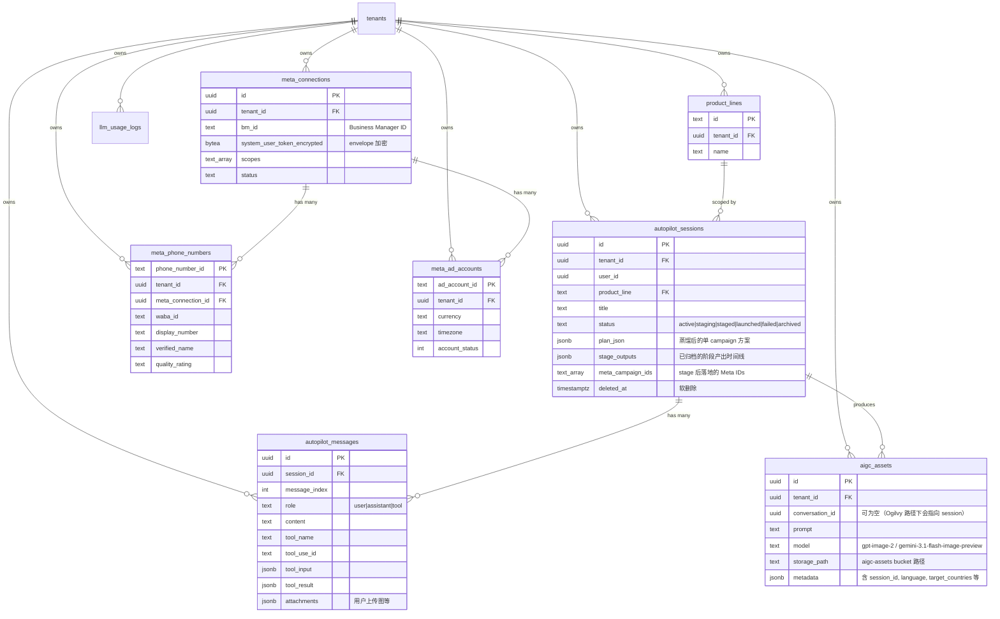
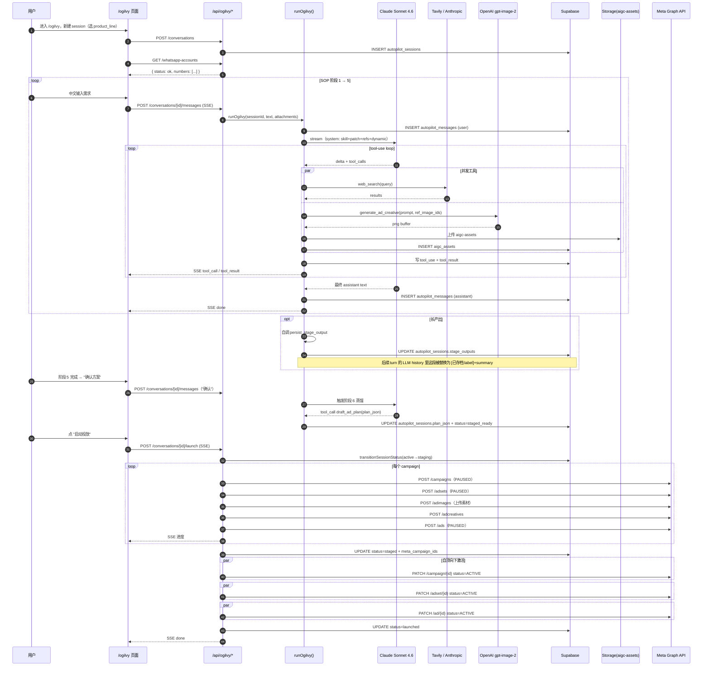

# Ogilvy — 产品与工程架构设计说明

> 文档版本：2026-05-17 · 与代码同步（main 分支）
> 代码位置：`src/agents/ogilvy/`、`skills/PromeEngine-ads-skill/`、`app/(app)/ogilvy/`、`app/api/ogilvy/`

---

## 0. 一句话定位

**Ogilvy 是 LeadEngine 的"获客投放"对话 Agent**——用户用中文对话提需求，Ogilvy 跑一套 6 阶段 SOP（需求收集 → 决策辅助 → 平台规则查询 → 市场分析 → 广告策略 → 素材生成 → 执行方案 → CTW 蒸馏），生成 Meta **Click-to-WhatsApp** 广告方案、画素材图、并能直接一键上线到用户的 Meta 广告账户。命名取自现代广告之父 David Ogilvy。

它的产品边界**只有一个**：**Meta CTW**（用户点广告 → 跳到 WhatsApp 对话）。不做 Google / TikTok / LinkedIn / Lead Form / 落地页，刻意收窄。

```
用户中文对话提需求 → Ogilvy 跑 6 阶段 SOP → plan_json → 一键上线 Meta（PAUSED → ACTIVE）
                            ↓
              生成的图存 aigc-assets bucket
              中间产出归档 stage_outputs[]
```

---

## 1. 产品角色与边界

### 1.1 它要做的事

| 能力 | 含义 |
|---|---|
| **多轮对话** | 用户用中文输入背景 / 产品 / 预算 / 目标市场；agent 按 SOP 推进 |
| **决策辅助** | 用户没想清楚 → 用 web_search / read_webpage 做实时市场 / 规则调研后给建议 |
| **生成创意图** | 阶段 4 调 `generate_ad_creative` 同轮并发生成 N 张广告图 |
| **方案蒸馏** | 阶段 6 把多市场 / 多漏斗方案蒸馏成单个 CTW campaign，调 `draft_ad_plan` 落库 |
| **一键上线** | 用户点 UI "启动投放" → 调 Meta Graph API stage（PAUSED）→ activate（ACTIVE） |
| **历史压缩** | 长产出主动调 `persist_stage_output` 归档原文、对话流里只留 200 字摘要 |

### 1.2 它故意不做的事

- 不投非 Meta 渠道（Google / TikTok / LinkedIn 一律不入 plan）
- 不投非 CTW 形态（Lead Form / 落地页 / 引流站全部不支持）
- 不让用户填技术 ID（phone_number_id / waba_id / page_id）——这些从用户已连接的 Meta BM 里自动注入
- 不直接调 Meta API 时让 agent "随便填"——`creative.image_url` 必须逐字复制 `generate_ad_creative` 返回的 Supabase URL；预检会扫描整个 plan，发现野 URL 直接拒
- 不在用户没确认前启动投放——`draft_ad_plan` 调成功后还有一道 UI 确认

---

## 2. 系统位置

```
浏览器 /ogilvy 页面 (OgilvyApp.js)
      │
      │ POST /api/ogilvy/conversations/[id]/messages  (SSE)
      ▼
runOgilvy() 生成器
      │  ├── system prompt 拼装：skill + host-patch + 6 个 reference 全部内联 + 动态段
      │  ├── tool-use loop：web_search / read_webpage / generate_ad_creative / draft_ad_plan / persist_stage_output
      │  └── 流式输出 delta + tool_call + tool_result 到 SSE
      ▼
autopilot_sessions / autopilot_messages / aigc_assets
      │
      │ 用户点 "启动投放"
      ▼
POST /api/ogilvy/conversations/[id]/launch  (SSE)
      │  ├── stageCampaigns  → Meta Graph API（创建 campaign/adset/creative/ad，全 PAUSED）
      │  └── activateCampaigns → 自顶向下 PATCH status=ACTIVE
      ▼
Meta 广告系统上线
```

---

## 3. 模块拆解

`src/agents/ogilvy/` 6 个文件：

| 文件 | 行 | 职责 |
|---|---|---|
| `index.js` | ~1115 | 主 orchestrator：拼提示词、跑 tool-use loop、流式持久化、工具分发 |
| `creative.service.js` | ~325 | `generate_ad_creative` 实现：gpt-image-2 主路径 + Gemini fallback + 落 aigc-assets bucket |
| `meta-launch.service.js` | ~381 | `stageCampaigns` / `activateCampaigns`：两阶段调 Meta Graph API |
| `tools.service.js` | ~281 | `web_search`（Tavily 主 / Haiku 备）+ `read_webpage`；会话级 3h 去重 |
| `whatsapp-accounts.service.js` | ~178 | 列用户在已连接 BM 下可用的 WhatsApp 号码 + 60s 缓存 |
| `skill-host-patch.md` | — | **宿主补丁**：附在 skill 之后，定义阶段 6 蒸馏、动态段消费、历史压缩协议、内联 references |

Skill bundle 在 `skills/PromeEngine-ads-skill/`（v1.0，4 层目录共 15 个 references）：

```
skills/PromeEngine-ads-skill/
  SKILL.md                                    # 6 主阶段 SOP 主文档(dim5 维度抽象)
  references/
    platforms/{meta,google,tiktok}.md         # 平台规范(V_1.0 默认锁 meta)
    industries/{automotive,agri-machinery,solar,generic}.md  # 行业知识 + 图片矩阵
    playbooks/{budget-and-bidding,targeting-and-audience,b2b-long-funnel}.md
    data-sources.md / compliance.md / creative-prompts.md
    _extension-status.md / _template-industry.md
```

**reference 加载方式**：通过 `read_skill_reference` 工具按需读取，skill 主文档会指明各阶段需要哪个 reference。可用 key 列表会附在 system prompt 末尾。

---

## 4. System prompt 与 cache 结构

Ogilvy 用 2 个 cache breakpoint（vs Medici 的 3 个）：

```
┌───────────────────────────────────────────────────────────────────┐
│ [0] SYSTEM_STATIC（≈ 22K tokens，cache_control: ephemeral）          │
│     = skill.systemPrompt + skill-host-patch + 6 个 references 全部内联 │
│     模块加载时一次性拼好，所有用户共享                                 │
├───────────────────────────────────────────────────────────────────┤
│ [1] DYNAMIC（≈ 200 tokens，不缓存）                                   │
│     - 当前账户可用 WhatsApp 号码列表（display_number / phone_number_id / waba_id） │
│     - page_id（用户 BM 下唯一）                                       │
│     - 用户已上传的产品图列表（1-based 索引）                            │
└───────────────────────────────────────────────────────────────────┘
```

History 部分最后一条 user/assistant 消息也打 ephemeral——5 分钟窗口内续聊命中缓存价仅 0.1×。

---

## 5. 工具集

### 5.1 工具清单（4 个外用 + 1 个收口）

| 工具 | 用途 | 调用时机 |
|---|---|---|
| `web_search` | 实时网检——市场 / 平台规则 / 竞品 | §4.C 规则查询、阶段 2 数据、阶段 1.5 决策辅助 |
| `read_webpage` | 配合 web_search 深读单一 URL | 同上 |
| `generate_ad_creative` | 生成广告图 | **仅阶段 4**，清单里每个素材调一次（同轮并发） |
| `persist_stage_output` | 归档大型产出 + 压缩对话历史 | 任何 ≥3000 字"成形可独立交付"产出后立即调 |
| `draft_ad_plan` | 提交最终 plan_json | **仅阶段 6**——蒸馏后由 host-patch 触发，skill 文档里不写 |

> skill 主文档里提到的 `read_skill_reference` 在 Ogilvy 这里被 host-patch 显式禁用（references 全部内联了）。

### 5.2 web_search 双路径

[src/agents/ogilvy/tools.service.js](src/agents/ogilvy/tools.service.js)：

```
Primary:  Tavily REST /search（advanced depth, $0.008/call）
Fallback: Anthropic Haiku + native web_search tool（$0.02 量级，旧路径）
```

会话级缓存：normalized query 去重，3h TTL，10K 条 LRU——实测 25–35% 命中率（agent 同会话里换措辞重查市场是常态）。

### 5.3 generate_ad_creative 双路径

[src/agents/ogilvy/creative.service.js](src/agents/ogilvy/creative.service.js)：

```
Primary:  OpenAI gpt-image-2（quality=high, 1024×1024 PNG）
Fallback: OpenRouter google/gemini-3.1-flash-image-preview
```

输入：`product_name` + `headline`（要逐字渲染在图上）+ `product_description` + `reference_image_ids[]`（1-based 索引，回到 dynamic context 取真实 Supabase URL，杜绝 hallucination）+ `target_countries` + `language`。

Prompt 拼装规则（buildCreativePrompt）：
- 商业摄影场景 + 产品保真（保留形状 / 颜色 / logo）
- headline 整字渲染（目标语言字符集）
- WhatsApp CTA 按钮
- 不出现电话号码 / 邮箱 / emoji

落地：上传到 Supabase `aigc-assets` bucket → 写 `aigc_assets` 行 → 返回 `{ url, storage_path, model }`。成本通过 `llm_usage_logs.call_site='ogilvy.image-gen'` 入账。

### 5.4 persist_stage_output 历史压缩

LeadEngine 主对话用 Claude Sonnet 4.6（1M context window），理论塞得下，但：
- 300K input × $0.003/K ≈ $0.9/turn——单 turn 成本随 input 线性涨
- input 远超模型训练长度时质量退化（context rot）

[skill-host-patch.md §5](src/agents/ogilvy/skill-host-patch.md) 的规则：

```
当你产出一段 ≥3000 字"成形可独立交付"的内容（10 章策划案、阶段 5 执行方案 + plan_json 雏形等），
立刻调 persist_stage_output({ label, summary, markdown })：
  - markdown: 刚刚输出的完整原文，逐字复制
  - label:    一句标识，如 "阶段 3 · 10 章 CTW 策划案"
  - summary:  200 字内关键结论
```

工具成功后，宿主 `ogilvy.repository.getMessagesForLLM()` 在重建 OpenAI history 时把这段 assistant text **替换**成 `[已存档:label]\n\nsummary`——对话仍连续，但 context 消耗从 20K 降到 200 tokens。UI 右侧 `StageArchive` 面板按 `autopilot_sessions.stage_outputs[]` 时间线展示完整原文。

---

## 6. 阶段模型（SOP）

skill 定义 6 个主阶段（[skills/PromeEngine-ads-skill/SKILL.md](skills/PromeEngine-ads-skill/SKILL.md)），host-patch 把阶段 6 输出收口到 CTW 蒸馏调 `draft_ad_plan`：

| # | 名 | 输入 | 输出 |
|---|---|---|---|
| 1.0 | 需求收集 + 业务模式识别 | 用户简述 | 产品 / 市场 / 预算 / 区域画像；标出不确定字段 |
| 1.5 | 决策辅助 | 1.0 的不确定字段 | 调 web_search 做调研 → 给建议 → 用户锁定 |
| §4.C | 平台 + 国家规则查询 | 1.0/1.5 完整 + 目标市场已定 | 合规约束（禁词、预算上下限、年龄规则） |
| 2 | 市场分析 | 1.0/1.5 + §4.C | 市场规模 / 增速 / 竞品景观 / TAM/SAM |
| 3 | 广告策略 | 1.0/1.5 + 2 + §4.C | 受众画像 / 创意切角 / messaging pillars |
| 4 | CTW 素材生成 | 1.0/1.5 + 3 + 用户上传的产品图 | 创意清单（N 张图 × N 套文案）；同轮并发调 generate_ad_creative |
| 5 | 执行方案 | 1.0/1.5 + 3 + 4 + 真实图 URL + §4.C | plan_json 雏形（不止 1 个 campaign）+ 操作手册 |
| 6 | CTW 蒸馏（**host-only**） | 阶段 5 完整 + 用户确认 | 单 campaign plan_json + draft_ad_plan |

### 6.1 阶段 6 蒸馏规则（[host-patch §2](src/agents/ogilvy/skill-host-patch.md)）

- **单 campaign**——多市场 / 多漏斗合并；按 `targeting.countries` 切多个 ad_sets
- `objective` **锁死** `WHATSAPP_CONVERSATIONS`——阶段 5 写的其它 ODAX objective 全部改写
- **丢弃**非 Meta-CTW 内容（Google / LinkedIn / TikTok / Lead Form / 落地页）
- 每条 ad 必填 `welcome_message`——客户从广告点进 WhatsApp 看到的预置首条消息；含产品名 + 开放式问题；按 §4.C 规则查到的当前 Meta 字符上限为准
- `whatsapp.phone_number_id` 从动态段选；`waba_id` / `page_id` 由 handler 自动补
- `creative.image_url` 逐字复制阶段 4 工具返回的 URL
- `daily_budget_cents` 单位为分，**放 campaign 层（CBO）不放 ad_set 层**
- 每个 ad_set 必须有 `countries` (ISO-2) + `age_min` + `age_max`

**sanity check**：阶段 4 没出现过成功的 `generate_ad_creative` 调用 → `draft_ad_plan` 拒收（防止 agent 跳过 SOP 直接出方案）。

---

## 7. 主流程：`runOgilvy()`

入口签名（[src/agents/ogilvy/index.js](src/agents/ogilvy/index.js)）：

```js
runOgilvy(sessionId, userText, attachments, userId) → AsyncGenerator<SSE_event>
```

执行步骤：

```
1. 加载 session + 已有 messages → getMessagesForLLM 重建 OpenAI history（含压缩替换）
2. 拼 dynamic system：当前可用 WA 号码 + page_id + 用户上传图 1-based 索引
3. 把 user message + attachments 持久化（autopilot_messages 一行）

4. tool-use loop（≤ MAX_ITERATIONS=10 轮）：
   while True:
     - OpenRouter Sonnet 4.6 stream（max_tokens=16384）
     - 流式 delta：每 200 字符进度式 JSON 解析，draft_ad_plan 时让 UI AdPlanCard 边填边渲染
     - 收到 tool_calls：
       · 在 DB 写 assistant text + 每个 tool_use 单独一行
       · Promise.all 并发跑工具，结果通过共享 eventQueue 推到 SSE
       · 按调用顺序写 tool_result 行
     - 无 tool_calls：
       · finish_reason='length' → 加 "continue" user 消息再跑
       · 否则持久化最终 assistant text → yield done → 退出

5. 异常处理：MAX_ITERATIONS 到 / OpenRouter 抛错 → 写错误 event + 状态恢复
```

会话状态转换原子化（[ogilvy.repository.js::transitionSessionStatus](lib/repositories/ogilvy.repository.js)）——CAS 防止双跑 / 双 launch。

---

## 8. 一键上线：两阶段 Meta 投放

用户在 UI 点 "启动投放" → POST `/api/ogilvy/conversations/[id]/launch`，handler 流式调 [meta-launch.service.js](src/agents/ogilvy/meta-launch.service.js) 的两阶段流程。

### 8.1 Phase 1: stageCampaigns（创建，全部 PAUSED）

**预检**：扫描整个 plan 里每条 ad 的 `image_url`——必须以 `ALLOWED_CREATIVE_URL_PREFIX`（我们的 Supabase storage 域名）开头，否则直接抛错。

对 plan.campaigns 里每条 campaign：

```
1. campaign (CBO)
   POST /{ad_account_id}/campaigns
   { name, objective: OUTCOME_ENGAGEMENT, status: PAUSED,
     daily_budget: <cents>, buying_type: AUCTION,
     bid_strategy: LOWEST_COST_WITHOUT_CAP,
     is_adset_budget_sharing_enabled: false }

2. ad_set（按 targeting.countries 切多个）
   POST /{ad_account_id}/adsets
   { name, campaign_id, optimization_goal: CONVERSATIONS,
     billing_event: IMPRESSIONS, destination_type: WHATSAPP,
     promoted_object: { page_id, whatsapp_phone_number: <plan.whatsapp.phone_normalized> },
     targeting: { age_min, age_max, geo_locations:{countries:[ISO-2]}, advantage_audience:0 },
     status: PAUSED }

3. ad image 上传
   把 Supabase 上的图片再下回来 → multipart POST /{ad_account_id}/adimages
   → 拿到 image_hash

4. ad creative
   POST /{ad_account_id}/adcreatives
   { name, object_story_spec: { page_id, link_data: {
       image_hash, headline, primary_text, description,
       link: "https://api.whatsapp.com/send",
       call_to_action: { type: "WHATSAPP_MESSAGE" },
       page_welcome_message: <JSON blob>
   }}}

5. ad
   POST /{ad_account_id}/ads
   { name, adset_id, creative:{ creative_id }, status: PAUSED }
```

每步出错按 `step` 归因（"campaign_create" / "adset_create" / "image_upload" / "creative_create" / "ad_create"），SSE 一边创建一边 yield 进度事件。

### 8.2 Phase 2: activateCampaigns（自顶向下 ACTIVE）

按层级 `[campaign → adset → ad]`：
- 每层内并发 `PATCH /{id}` 设 `status=ACTIVE`
- 层间串行（Meta 会按层级计算 effective_status，串行只是显式态度）

### 8.3 Session 状态机

```
active → staging → staged   （stageCampaigns 成功，所有 ID 落 autopilot_sessions.meta_campaign_ids）
       ↘            ↘
        failed       launched   （activateCampaigns 全部成功）
                ↘
                 failed         （activate 部分失败，所有创建出来的对象仍是 PAUSED 状态可手动启）
```

---

## 9. 数据模型



**表命名遗留**：`autopilot_*` 是 Ogilvy 之前一版（Autopilot）留下的，代码里全称 "Ogilvy session"——表名为了保留向前兼容没改。

存储：
- `aigc-assets`：Ogilvy 生成的素材图（公开读）
- `chat-uploads`：用户上传的产品参考图

---

## 10. API 路由

| Route | Method | 用途 |
|---|---|---|
| `/api/ogilvy/conversations` | GET | 列当前 tenant 的 session + 已绑定 WA 号码的 product_line 列表 |
| `/api/ogilvy/conversations` | POST | 新建 session（必须挂在某个绑定了 WA 的 product_line 下） |
| `/api/ogilvy/conversations/[id]` | GET | 加载 session + 全部 messages（重建 UI 时间线） |
| `/api/ogilvy/conversations/[id]` | DELETE | 软删除（`deleted_at = now()`） |
| `/api/ogilvy/conversations/[id]/messages` | POST | 发消息 + SSE 流（runOgilvy 异步生成器） |
| `/api/ogilvy/conversations/[id]/launch` | POST | 两阶段 stage+activate Meta 投放，SSE 流 |
| `/api/ogilvy/conversations/[id]/usage` | GET | 该会话 token / cost 聚合（从 llm_usage_logs 按 session_id 汇总） |
| `/api/ogilvy/upload` | POST | multipart 上传到 chat-uploads bucket，返回 `{url, storage_path}` |
| `/api/ogilvy/whatsapp-accounts` | GET | 列当前用户可用的 WA 号码（可选 `?force=1` 跳缓存） |

---

## 11. 前端 UI 结构

```
app/(app)/ogilvy/
  page.js                    # Next App Router 入口（client component）
  OgilvyApp.js               # 顶层 layout：sidebar + chat + stage archive
  components/
    AdPlanCard.js            # 渲染 plan_json（campaigns/adsets/ads 树 + 启动投放按钮）
    AdCreativePreview.js     # 显示生成的广告图 + headline overlay
    StageArchive.js          # 归档时间线，可展开看完整 markdown
    UsageBadge.js            # 当前会话 token / 1M 上限 / 成本概览
    WhatsAppGateCard.js      # 前置闸口：未连 BM / 无可用号码时阻断聊天
  hooks/
    useMessageStream.js      # 包 SSE：send / stop / streamingText / toolStatus / isStreaming
```

**关键 UI 行为**：
- WhatsApp gate：进页面先调 `/whatsapp-accounts`；状态 `ok`/`only_test_or_unverified`/`no_phone`/`not_configured` 决定能否聊
- 边流边渲染：`useMessageStream` 在 SSE delta 来的时候每 200 字符尝试 `tryPartialJson` 解析；agent 输出 `draft_ad_plan` 工具调用时，AdPlanCard 实时填充（campaign 名先出、adset 数后出、ad 内容最后出）
- 工具进度：`tool_call` 事件立刻显示"正在调 generate_ad_creative…"，`tool_result` 来了切到"完成 2/3"
- 模块级 session 缓存：30s fresh window 让侧栏切换 session 秒开

---

## 12. 完整业务流程（Mermaid）



---

## 13. 安全 / 防御性设计

| 风险 | 防御 |
|---|---|
| LLM 在 plan_json 里编 image URL | `creative.service.isAllowedCreativeUrl` 严格匹配 Supabase 前缀；stageCampaigns 入口预检整 plan；每 ad 创建前再扫一遍 |
| LLM 把用户其它会话的图当参考 | `generate_ad_creative` 只接受 1-based 索引，索引到 URL 的映射只在当前 session scope |
| 双跑 / 双 launch | `transitionSessionStatus(from:[...], to:..)` 原子 CAS；状态不符直接拒 |
| 历史污染 | 软删除（`deleted_at`），不真删——2026-05-11 一次误删事故后改的，FK 级联会顺带删 messages，数据不可恢复 |
| Meta token 泄漏 | `meta_connections.system_user_token_encrypted` envelope 加密，密钥从 `META_TOKEN_ENCRYPTION_KEY` 环境变量取；只在最里层 service 解密 |
| 跳过 SOP 直接交方案 | `draft_ad_plan` sanity check：阶段 4 没成功调过 `generate_ad_creative` → 拒收 |
| context rot | persist_stage_output 主动压缩 ≥3000 字产出 → 后续 turn 只看 200 字摘要 |
| 工具调用串行慢 | 同轮多 tool_call `Promise.all`；广告图 N 张同时画，总耗时取慢的那张 |

---

## 14. 性能与成本

| 维度 | 当前做法 |
|---|---|
| **模型** | 单主对话固定 Claude Sonnet 4.6 (1M context) via OpenRouter；不做"小模型分发"——Sonnet 一个 cache 就好 |
| **system prompt cache** | 22K tokens 静态段 ephemeral，5 分钟内续聊读价 0.1× |
| **web_search 缓存** | 会话级 3h LRU；25–35% 实测命中率 |
| **image gen** | gpt-image-2 主路径——升级自旧 gpt-image-1，速度 / 质量提升；OpenRouter Gemini fallback |
| **history 压缩** | persist_stage_output 把 20K tokens 的阶段 5 方案压成 200 tokens 摘要 |
| **token 计量** | 每次 LLM / image 调用写 `llm_usage_logs`（含 `cache_creation_input_tokens` / `cache_read_input_tokens` / `cost_usd`） |
| **会话 token 上限** | UI 在 UsageBadge 提示当前会话已用 input token / 1M 上限——视觉提醒用户长 session 该新开 |

---

## 15. 可观测性

- **SSE 事件类型**：`delta`（assistant text）/ `tool_call` / `tool_result` / `done` / `error`——前端 useMessageStream 全监听
- **`llm_usage_logs.call_site`**：`ogilvy.turn`（主对话）/ `ogilvy.image-gen` / `ogilvy.web-search`
- **`autopilot_sessions.stage_outputs[]`**：完整阶段产出归档时间线
- **`fix_log` JSONB**：launch 出错时记录每一步的 step + error，方便排查

---

## 16. 设计取舍

| 取舍 | 选择 | 理由 |
|---|---|---|
| **single product（CTW only）** | 是 | 收窄到最确定的形态，不做平台兼容；其它形态在 host-patch 里被显式拒绝 |
| **references 全部内联** | 是 | 单会话不会跑多轮但每轮都要用 references；进静态 cache 段一次写多次读最划算 |
| **同轮并发工具** | 是 | 画 N 张图同时画，省 N-1 倍慢 |
| **生成图 URL 严格白名单** | 是 | LLM 编 URL → Meta 上传失败甚至误投真实第三方资源——不可接受的灾难面 |
| **两阶段 launch（PAUSED → ACTIVE）** | 是 | 创建中途失败也只是堆了 PAUSED 对象，不会真投出去；activate 失败可以手动到 Meta 后台启 |
| **table 名保留 autopilot_*** | 是 | 改名要写迁移，向前兼容拖累没必要；代码里口径已统一叫 Ogilvy |
| **不用 Claude Skill SDK** | 是 | 用 Anthropic 自家 skill bundle 加 host-patch 模式——文件级热替换、host 收口集中在一个 .md 里清楚可审计 |
| **draft_ad_plan 由 host-patch 拥有** | 是 | skill 写"提交方案"是普适的；CTW 的 plan_json 形状是 LeadEngine 特化，留在 host 这一侧 |

---

## 17. 与 Medici 的关系

Ogilvy 投出去的 CTW 广告，客户点击后跳到 WhatsApp，**接客的是 Medici**：

- Ogilvy 投放时把 `whatsapp.phone_number_id` 落进 Meta 广告系统
- 客户点广告进 WhatsApp 发第一句话，Meta webhook 把 `referral.source_id`（= ad_id）一并送过来
- LeadEngine webhook 把 ad_id 落进 `conversations.meta_ad_id` 和 `contacts.metadata.last_referral`
- Medici 在 `ad_referral` 上下文里读到广告承接产品 / 卖点，承接对话

闭环：**Ogilvy 获客 → Medici 接待成交 → leads 落库 → 后续可一键同步外部 SCM**。

详见 [medici-design.md](medici-design.md)。
